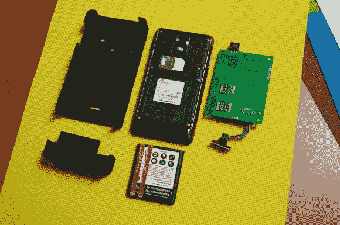

# 基于红外的增强现实

> 原文：<https://hackaday.com/2013/03/25/ir-based-augmented-reality/>

为了最终的设计项目，[弗兰克]和他的团队承担了一个增强现实项目。目标是通过智能手机指向物体，使物体可以被交互控制。他们的解决方案是[增强现实通用控制器和识别器](http://frank-zhao.com/cache/aruci.php "ARUCI") (ARUCI)。

该系统通过感测包含每个物体的标识符的 IR 信标来定位可控物体。红外线由一个集成在定制 PCB 中的红外传感器接收。这种电路板位于 3D 打印的外壳中，安装在智能手机的背面。电子设备由手机电池供电。

命令通过使用 ATmega128RFA1 实现的自定义 2.4 GHz 协议发送到设备。每个设备都有另一个 ATmega 来接收信号和控制现实世界的对象。在他们的演示中，该小组展示了系统控制设备，包括电视、收音机和遥控汽车。

该系统提供了一种有趣的与对象交互的方式，硬件集成令人印象深刻。休息之后，观看[Frank]的演示。

[https://www.youtube.com/embed/svA_LgLgTUE?version=3&rel=1&showsearch=0&showinfo=1&iv_load_policy=1&fs=1&hl=en-US&autohide=2&wmode=transparent](https://www.youtube.com/embed/svA_LgLgTUE?version=3&rel=1&showsearch=0&showinfo=1&iv_load_policy=1&fs=1&hl=en-US&autohide=2&wmode=transparent)