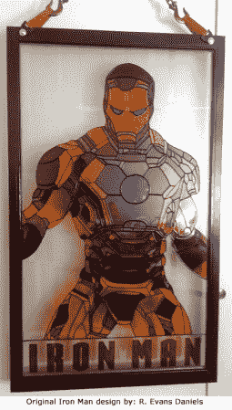

# 钢铁侠人造彩色玻璃节省了 4k 美元

> 原文：<https://hackaday.com/2013/01/25/iron-man-faux-stained-glass-saves-4k/>

看看光线是如何照射到这件艺术品上的。这是一块非常令人信服的彩色玻璃…除了它是假的。[Sdtacoma]想出了一种用单一面板模仿彩色玻璃的方法。这个项目的灵感来自于看到[一个以钢铁侠](http://www.reddit.com/r/pics/comments/11napt/i_started_teaching_myself_stained_glass_18_months/)为特色的真实彩色玻璃面板，在 Etsy 上售价 4500 美元。

由于大众的需求，[Sdtacoma]发布了他所使用的技术的专辑。从网上找到的一些艺术作品开始，他把它做成黑白的，放大到合适的尺寸(这个东西大约有五英尺高)，然后用色调分离技术用多张纸打印出来。

框架和玻璃是在一家回收建筑用品商店发现的。清理后，他用纸模板用液体铅在不同颜色的部分之间划出分界线。该产品具有一定的尺寸(有点像织物的蓬松涂料)，看起来像彩色玻璃窗格之间的铅迹。干燥后，用滴管加入颜色，涂上玻璃颜料。