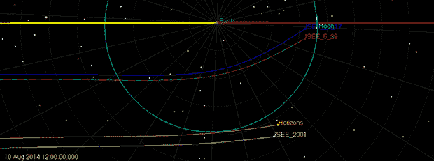

# ISEE 3 号:正在回家的路上

> 原文：<https://hackaday.com/2014/06/08/isee-3-on-track-to-come-home/>

Intended trajectory from ICE team in 1986 (blue), 2001 ephemeris of ISEE-3 (white) and current ephemeris (red/green). Click to embiggen.

当我们最后一次听到指挥废弃的 ISEE 3 号卫星进入地球和太阳之间的稳定轨道的进展时，该团队刚刚使用阿雷西博的巨型碟形天线与探测器取得联系，发送了一些命令，并开始收集数据以绘制航天器的位置和未来位置。一周内发生了很多事情，团队现在很高兴地报告[号飞船还活着，情况良好](http://spacecollege.org/isee3/updated-ephemeris-for-isee-3-at-jpl-horizons.html)，并且比最初认为的更接近预定轨道。

上周之前，关于 ISEE 3 号前进方向的最佳数据来自一个 13 年前的数据集，这使得项目协调员认为，大约 50-60 米/秒的机动是必要的，以便将航天器送入地球和太阳之间的正确轨道。根据阿雷西博的新数据，这个数字已经降低到大约 5.8 米/秒，非常接近 1986 年最初 ICE 导航团队的预期目标。这也给了团队一点喘息的空间；最初计划的捕获飞船的机动需要将近三分之一的可用燃料。新计划只要求航天器消耗大约 5%的燃料储备。这当然提出了在地球-太阳 L1 点以外继续重新启动的 ISEE-3 计划任务的想法，但这非常本末倒置。

当然，获得航天器的测距数据只是本周 ISEE 3 号发生的事情的一小部分。多亏了派往阿雷西博安装硬件并试图与卫星取得联系的“远行团队”，[两个收发器都在工作](http://spacecollege.org/isee3/isee-3-status-report-6-june-2014-afternoon.html)，遥测数据正从探测器下载，精确 ISEE 3 号的准确位置的工作已经开始，以计算航天器需要在何时何地进行机动。

常规黑客日功能和软件定义无线电之神[巴林特]与阿雷西博的客队一起在地球上最大的碟形天线上安装他公司的 SDR 单元。他的快乐舞蹈来自 ISEE-3 的第一批数据在博客上流传，但是[的展示](http://spench.net/drupal/files/Balint_Seeber-ISEE-3_Reboot_Project.pdf) (PDF) [和照片画廊](http://gallery.spench.net/v/Arecibo/)更好地讲述了在这个星球上最大的盘子上工作的故事。

ISEE 3 号团队仍有大量工作要做，因为他们想出了捕捉飞船的最佳方式，并为接下来一周的燃烧做好了准备。他们应该在本周早些时候确定 ISEE 3 号的准确轨道，之后，ISEE 3 号可以在不到两周的时间内返回家园。