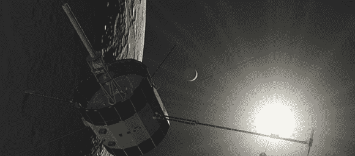

# ISEE 三号:准备回家了

> 原文：<https://hackaday.com/2014/05/16/isee-3-ready-to-come-home/>

致力于重启 ISEE 3 号卫星的团队正在努力工作，该卫星将于 8 月份与地球相遇。他们已经建立了一个众筹页面，现在他们已经完全获得了资助(顺便说一句，不要停止捐赠)，他们开始深入水域，这将使他们能够捕获一颗被遗忘的卫星。

项目[发布了一份状态报告](http://spacecollege.org/isee3/isee-3-reboot-project-status-and-schedule-for-first-contact.html),回顾了他们到目前为止已经完成的工作，以及还有哪些工作要做。几个月来，他们知道飞船上的两个发射器都在工作，但他们没有发送遥测数据。该团队已经仔细阅读了文档，提出了一组命令，目前正在前往阿雷西博传输这些命令的途中。

正在建造两个地面站发射机，其中一个是专门为这一应用而建造的，安装在阿雷西博。另一个是便携式独立的 700 瓦发射机，将用于肯塔基州莫尔黑德州立大学的官方 ISEE 3 号地面站。

Ettus Research 的 SDR 负责发送和接收，大量工作集中在命令和遥测系统上。在 1978 年，至少可以说命令和遥测的用户界面是原始的。该团队现在正在开发一个内置 Labview 的系统，它比老式的文本终端屏幕更容易看。

到目前为止，来自 ISEE 3 号的信号计划在莫雷黑德州的阿雷西博和德国的波鸿天文台接收。这将使该小组在一天的大部分时间里都有非常好的覆盖范围，加利福尼亚州的其他地面站将使该小组每天与 ISSE 3 号通信的时间延长几个小时。

还有很多工作要做；该团队真的不知道哪些系统仍在运行，尽管大多数系统在 20 年中只出现过一次故障。在接下来的几天里，我们将会看到这颗卫星是否能够完成返回地球的任务。如果一切按计划进行，ISEE 3 号将在 6 月中旬的某个时候朝着燃烧 17 个小时的方向前进，并进入正确的轨道。