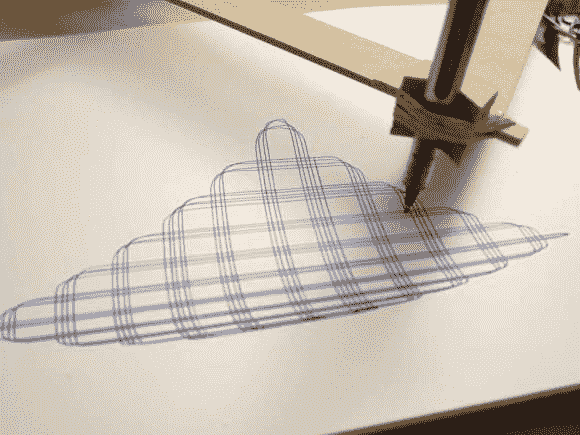

# iso cel-Ease 绘图机器人令人着迷

> 原文：<https://hackaday.com/2014/05/21/isoscel-ease-drawing-robot-is-mesmerizing/>

画画对很多人来说很难…那么，为什么不造一个机器人来帮你呢？[Darcy]有了一个相当独特的绘图机器人的想法——他称之为[iso cel-Ease。](http://inventorartist.com/isoscel-ease-drawing-robot/)

而不是使用一个无聊的 XY 龙门，一个 deltabot，或使用一个[剪式连杆](http://inventorartist.com/art-o-matic-v1/)(实际上那个很酷！)，[Darcy]决定尝试利用三角形几何的力量！你大概能猜到，联动装置形成一个等腰三角形，因此得名。一对步进电机增加和减少三角形的奇数边，允许在页面上进行全方位的连续墨水移动(没有笔驱动器)。

这是一个非常酷的小绘图机器人，它完全是在 SketchUp 中设计的——他在自己的网站上有很多构建过程的照片和示例图——但不要忘记在休息后留下来看看它的运行视频！

[https://www.youtube.com/embed/1EZbtXzBQZg?version=3&rel=1&showsearch=0&showinfo=1&iv_load_policy=1&fs=1&hl=en-US&autohide=2&wmode=transparent](https://www.youtube.com/embed/1EZbtXzBQZg?version=3&rel=1&showsearch=0&showinfo=1&iv_load_policy=1&fs=1&hl=en-US&autohide=2&wmode=transparent)

对于另一个独特的绘图机器人，谁会忘记机器人蚀刻草图呢？