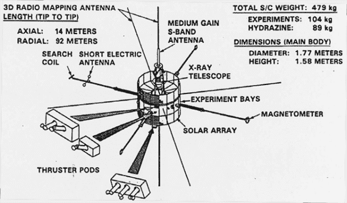

# ISEE 3 号:我们收到信号了

> 原文：<https://hackaday.com/2014/03/10/isse-3-we-get-signal/>

在太空深处，距离是从地球到月球距离的 100 多倍，有一艘孤独的宇宙飞船优雅地旋转着，准备与我们的星球相遇。这是 ICE/ISEE-3，一个被官方太空机构遗忘已久的探测器。现在，致力于重新利用这颗卫星[的团队已经在德国使用 20 米的卫星碟形天线与探测器](http://amsat-uk.org/2014/03/09/radio-amateurs-receive-nasa-isee-3ice-spacecraft/)取得了联系。

当我们第一次听说志愿者的[计划通信时，没有人确定探测器还活着。这颗卫星仍在运行，这并不奇怪；它于 1978 年发射，大多数仪器在 2008 年仍在运行。然而，这是业余爱好者——而不是美国宇航局——第一次收到探测器的信号](http://hackaday.com/2014/02/14/call-for-hams-and-hackers-welcome-iceisee-3-home/)

致力于复兴该航天器的志愿者小组 ICEteam 使用 Boshum 天文台的巨大碟形天线来检测来自航天器的 5 瓦载波信号。这就是探测器目前发出的所有信息——没有收到任何数据——但这是一项巨大的成就，也是将冰/ISEE-3 号引导到地球-太阳拉格朗日点周围轨道的第一步。

*边注:看着[星历数据](http://ssd.jpl.nasa.gov/horizons.cgi#results)(目标-111)我*认为* ICE/ISEE-3 将在最接近地球的夜侧上方。有人能证实这一点吗？这是否意味着未来在 L2 的任务？*

下面是 ICEteam 的视频。

[https://www.youtube.com/embed/t2YRxdpjce0?version=3&rel=1&showsearch=0&showinfo=1&iv_load_policy=1&fs=1&hl=en-US&autohide=2&wmode=transparent](https://www.youtube.com/embed/t2YRxdpjce0?version=3&rel=1&showsearch=0&showinfo=1&iv_load_policy=1&fs=1&hl=en-US&autohide=2&wmode=transparent)