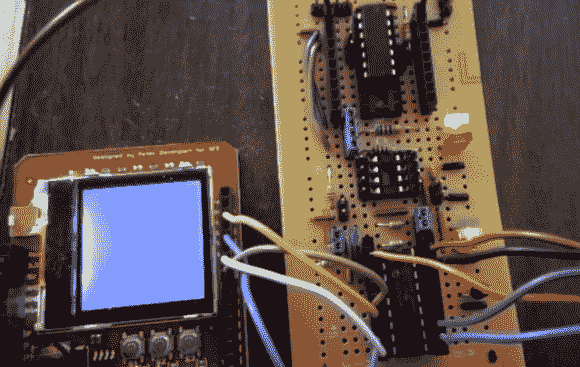

# Java Grinder 吐槽 DsPIC 和 MSP430 汇编代码

> 原文：<https://hackaday.com/2014/02/10/java-grinder-spits-out-dspic-and-msp430-assembly-code/>

[迈克尔·科恩]发来了一个他最近正在做的项目的链接。Java Grinder 是一个项目，[转换 Java 代码用于微控制器](http://www.mikekohn.net/micro/java_grinder.php)。这实际上要追溯到 2009 年，当时他提到这个项目毫无价值，因为已经有大量的 Java 虚拟机了。但是如果他真的认为他永远学不到任何东西。我们很高兴[迈克尔]重新拾起这件事，并从中得到一些东西。

上图展示了概念证明。这是一个在诺基亚 6100 屏幕上跳动的盒子。他用 Java 编写了动画，并使用他的 grinder 将代码转换为 dsPIC 汇编，然后编译并闪存到微控制器上。这还不是全部，他还编写了一个 Mandelbrot 集合生成器或相同的硬件。事实上，他也可以生产用于 MSP430 芯片的汇编代码。

这种探索对大脑很有好处。我们把它看作是你从 Nand2Tetris 中学到的知识的自然[延伸，它贯穿了基本的文本*计算系统的元素*。如果你不熟悉的话，这是从构建你的第一个逻辑门开始的旅程，你和其他人一起构建一个 ALU，然后开始一路编码直到一个虚拟机在你的模拟硬件上运行。](http://hackaday.com/2012/10/11/programming-tetris-by-first-building-a-logic-gate-then-a-computer-then/)

下面是弹跳箱和 Mandelbrot 布景的视频。

[https://www.youtube.com/embed/dPkgeOOZxNw?version=3&rel=1&showsearch=0&showinfo=1&iv_load_policy=1&fs=1&hl=en-US&autohide=2&wmode=transparent](https://www.youtube.com/embed/dPkgeOOZxNw?version=3&rel=1&showsearch=0&showinfo=1&iv_load_policy=1&fs=1&hl=en-US&autohide=2&wmode=transparent)