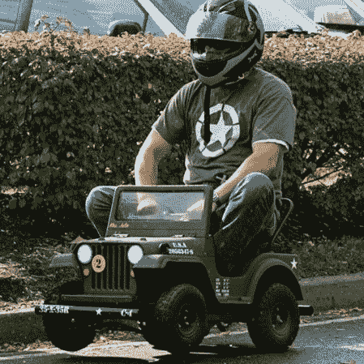
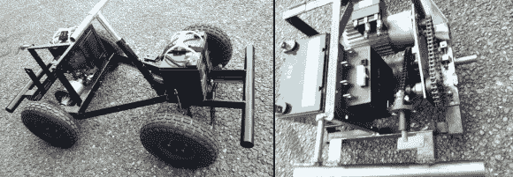

# 吉普动力轮升级只重用身体

> 原文：<https://hackaday.com/2014/06/04/jeep-power-wheels-upgrade-only-reuses-body/>

有争议的是[杰米]是否升级了他的动力轮吉普，或者制造了一辆迷你车，只增加了一个动力轮吉普车身。不管怎样，这辆[赛车动力轮吉普车](http://www.instructables.com/id/Make-a-Racing-Powerwheels-Jeep/?ALLSTEPS)都很棒。该项目的目标是参加在 Maker Faires 举行的[赛车系列](http://www.powerracingseries.org/)比赛。

这辆车不是闹着玩的。它仍然是电动的，但使用 24 伏 DC 电压。它有用于牵引的充气橡胶轮胎和用于停止的盘式制动器。“气体”表是一个电压表，安装在仪表板上，靠近电机温度计。好像这还不够，头灯和尾灯的工作。注意那个可爱的定制相框，它大部分是由一个旧的床架制成的。

为了快速移动一个成年人,[Jamie]正在使用两个串联的 12v 电池来达到 24v 的目标。DC 驱动电机的额定电压只有 12v，因此需要温度计，它会变热。在电池和马达之间有一个电子速度控制器，它是从托盘搬运车上拆下来的。速度控制允许可变油门，从而实现平稳可控的加速。马达的旋转能量在到达车轮之前通过一个旧的电动轮椅差速器传递。总的来说，这个小钻机可以达到 25-30 英里每小时。

定制的军用吉普车油漆工作为这个项目增加了一些展示。如果你心里有你年轻的后代，这可能不是最好的项目。要获得更适合孩子的方法，请查看。

[https://www.youtube.com/embed/nN2MFzjuCcE?version=3&rel=1&showsearch=0&showinfo=1&iv_load_policy=1&fs=1&hl=en-US&autohide=2&wmode=transparent](https://www.youtube.com/embed/nN2MFzjuCcE?version=3&rel=1&showsearch=0&showinfo=1&iv_load_policy=1&fs=1&hl=en-US&autohide=2&wmode=transparent)