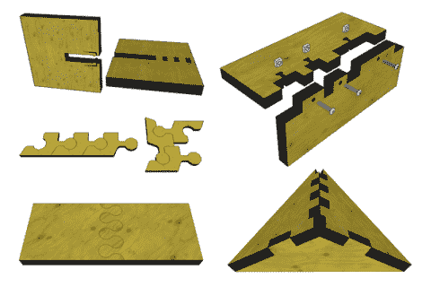

# 细木工肯定会对你的下一个板材附件有用

> 原文：<https://hackaday.com/2012/04/16/joinery-sure-to-be-useful-on-your-next-sheet-goods-enclosure/>

很难成为所有方面的专家，但是[这一组木工技术](http://blog.makezine.com/2012/04/13/cnc-panel-joinery-notebook/)会让你的下一个项目看起来像是刚刚完成机械工程学位。他们的目标是在项目中使用的薄板胶合板是数控切割，使外壳和零件。[肖恩·拉冈]提到这些都不是新的，但我们还没有遇到像这样大量的例子。

上面显示的接头解决了一系列不同的需求。你可能已经熟悉了右下角的接缝，它为盒子提供了很好的边角，为粘合提供了很大的表面积。但就在那上面是这个想法的一个简单变化，包括方形螺母的槽。这种类型的机械紧固件带来了强度，同时保留了再次拆开接头的选择

在左上方，你可以看到一个包含弹簧锁的设计。当这两个部件被开槽在一起时，倒钩弯曲，直到它们找到它们的配合开口并将部件牢固地保持在一起。下面是一些球状的手指关节，它们不需要胶水来保持在一起。

[Sean 的]帖子不断提到这些设计。他甚至涵盖了我们非常喜欢的激光切割可弯曲铰链。