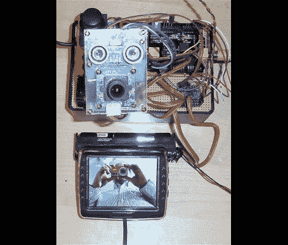

# 操纵杆控制的安全摄像头会俯瞰护城河

> 原文：<https://hackaday.com/2012/07/13/joystick-operated-security-cam-will-overlook-the-moat/>

如果没人守卫，护城河有什么用？我们认为这取决于潜伏在水面下的动物，但这无关紧要。LVL1 的成员继续追求在增强建筑的自动化功能方面超越彼此。最新的产品是这款[安全摄像机，由模拟拇指棒](http://wiki.lvl1.org/Surveillance_Module)操作。

这些人正在他们的大门前修建护城河(这个城市的东西是一个倒影池)。现在，他们将能够看到和感觉到是否有人试图越过水的危险。黑客将超声波测距仪和相机模块与一对伺服电机结合在一起。马达的支架允许全范围的运动，信号由 Arduino 和[视频实验者屏蔽](http://hackaday.com/2011/03/24/video-experimenter-shield/)转换，以输出复合视频信号。这不会让流媒体变得那么容易，但我们确信这只是又一次黑客攻击。