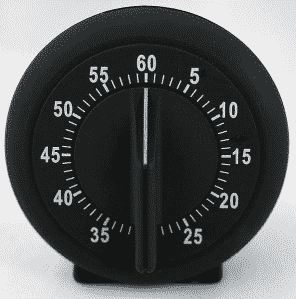

# 聚光灯下的法官:杰克·甘索

> 原文：<https://hackaday.com/2014/06/10/judge-spotlight-jack-ganssle/>

本周，我们对哈卡代奖评委[杰克·甘斯勒]有了更多的了解。他在嵌入式系统方面的丰富经验令人生畏，最近我非常有兴趣了解他在嵌入式代码领域提高产品质量的使命。我们稍后会谈到这个问题，但我想从[杰克]对我最后一个问题的回答开始。

* * *

你还有什么想让我们的观众了解你的吗？

当第一个 8 位处理器(8008)问世时，我进入了这个领域，并且仍然觉得它非常迷人。我写了很多关于嵌入式主题的文章，并在除南极洲之外的所有大洲举办讲座和研讨会(到目前为止！).我们住在树木茂密的马里兰州芬克斯堡，每年的这个时候都非常迷人，而且，因为我的办公室就在房子里，通勤还算可以。其他爱好包括航海；我写了一本关于独自横渡大西洋的在线书籍(www.ganssle.com/jack)。很棒的旅行，除了失去了船。

* * *

多年来，你一直站在固件的前沿。你看到互联设备发生了怎样的变化？

 没有电线！以前大多数连接是 RS-232 或 RS-485。然后我们得到了 GP-IB，后者被编入 IEEE-488。现在有如此多的近场和非近场无线接口。协议的复杂性也急剧上升。
一个新的转变是真正廉价的 ARM Cortex-M 系列 MCU 的出现。有的是几毛钱的量。许多将运行在毫安。这些都会让互联设备行业真正腾飞。

* * *

我一直是[你关于按钮去抖](http://www.ganssle.com/debouncing.htm)的研究的粉丝，你在研究中提到软件解决方案比硬件解决方案更常见。两者之间你有偏好吗？

  我更喜欢硬件解决方案，因为你可以获得完美的去抖效果。然而，这通常是错误的商业决策，因为它比使用软件要昂贵得多。所以，我做这些研究的原因是想看看开关到底是如何工作的。事实证明，工程师们有自己最喜欢的去抖时间(10 毫秒、20 毫秒，无论什么)，但这个数字没有真正的依据。这是天意工程。正如戴明所说“我们相信上帝；其他的都带数据。”

* * *

你可能会对黑客日大奖的参赛作品代码感兴趣。你通常是如何建议人们编写易读的代码的？

一个朋友曾经告诉我，他认为 C 是给讨厌打字的人用的。这话有些道理。干净的代码意味着大量的空白，使用描述性的和经过深思熟虑的名字，以及大量适当的注释。每当我看到一个函数没有一个很好的注释头块，我就作呕。事实上，编写代码的正确方法是首先编写所有的注释。这是最难的部分，这就是设计。然后任何人都可以填写代码。**编者按:**查看【杰克的】[评论代码指南](http://www.ganssle.com/commenting.htm)

* * *

我最近听到了[你在制作嵌入式系统播客](http://embedded.fm/episodes/2014/5/27/53-being-a-grownup-engineer)上的采访。看起来你是一个彻底改变快速开发固件并花很长时间调试它的公认实践的倡导者。对于刚开始接触固件的人来说，有什么资源可以推荐给他们，让他们从一开始就学习更好的实践吗？(提及您的研讨会的绝佳地点)

> 一般嵌入式项目花费 50%的时间在调试上，所以我猜另外 50%是在调试。

我和世界各地的工程师一起工作，并观察到太多的人急于尽快开始编码。这种模式是编写大量代码并花费大量时间调试。一般嵌入式项目花费 50%的时间在调试上，所以我猜另外 50%是在调试。我们需要减少麻烦，让设计良好的产品更快上市。我在我的“更好的固件更快”研讨会上提出了这个概念，并写了很多相关的文章(见[http://www.ganssle.com](http://www.ganssle.com))。查看个人软件过程，寻找一些好的资源。在 Ada 上使用 Google 即使你不使用这种语言，它的理念也是正确的。卡彭斯·琼斯写的所有东西都很棒。

* * *

在那次采访中，你也提到了代码审查的重要性。如何在只有一个代码开发人员的项目中很好地应用这一优点？对 2-3 个开发人员的小团队有什么建议吗？

代码评审意味着做两件事:给代码带来更多的眼球，打破“不用想太多就能快速编写大量代码并开始调试”的不良循环。小团队仍然受益于一双或多双阅读代码的眼睛。一个人的商店让这变得更难，所以我建议写下这些东西，然后把它放在一个隐喻的架子上一周。然后自己复习。在进行任何测试之前，请先这样做。保留指标——你发现了多少问题——并设定一个目标，随着时间的推移减少这些问题。我们想预先做好工作:把它做好，然后用测试来证明它确实是正确的，而不是找出错误。

* * *

你经常写项目管理和处理时间紧张的麻烦。我们有黑客日奖的截止日期。你通常如何确保项目按时完成？

 正如道格拉斯·亚当斯所说“我爱截止日期；我喜欢它们嗖嗖飞过的声音！”首先，他们必须现实。这意味着在准备过程中要非常小心，老板不能随意改变。这也意味着管理变化:变化总是会发生，但它也有成本(金钱和/或时间)，我们必须对此负责。而且，时间表必须得到管理；我们需要定量的、主动的管理，从第一天起就指导项目，而不是在截止日期前一周开始喊管理。

* * *

虽然你现在写和谈论软件工程科学，但你已经是技术社区的一员很多年了。你见过的最酷的按时完成工作的方法是什么？

 [ 阿波罗 14 号](http://en.wikipedia.org/wiki/Apollo_14)。记得 13 号是指令舱爆炸的那一天。14 真的要工作了。在月球轨道上，登月舱的中止开关短路了(可能是因为一个浮动的焊球)。任务规则说他们有 4 个小时可以开始降落，否则将不得不中止任务。麻省理工学院的人想出了一个聪明但非常快速的软件解决方案，挽救了这项任务。谈酷！

* * *

有很多有软件背景的人对嵌入式开发感兴趣。你能谈一谈他们应该把硬件研究的目标放在哪里，以及他们应该深入到什么程度，以便在成为固件工程师的道路上完善他们的技能组合吗？

近年来，我从许多经理那里听说，他们找不到在电子方面有良好基础的固件人员，然而正是硬件真正定义了嵌入式系统，并且将固件与普通的、乏味的(在我看来！)IT 软件。每个固件人都应该有一些电子知识。你不需要成为一个 ASIC 设计者，但是你需要熟练使用示波器和逻辑分析仪。你对电子学了解得越多，就越容易找到工作。

我的[嵌入式 Muse 简讯](http://www.ganssle.com/tem-subunsub.html)涵盖了这一点。我发布了[一些关于入门的资源](http://www.ganssle.com/startinges.htm)(因为我经常被问到这个问题)。买块板，比如飞思卡尔的 FRDM-KL25Z(13 美元)，然后做点东西。Digilent 的[模拟器件套件](http://www.digilentinc.com/Products/Detail.cfm?NavPath=2,393,666&Prod=APK)是学习模拟电子技术的绝佳资源。我是《业余无线电爱好者手册》的忠实读者，该手册是学习一般电子学的资源。

* * *

**图片来源:**

*   [8008](http://commons.wikimedia.org/wiki/File:KL_Intel_C8008-1.jpg#mediaviewer/File:KL_Intel_C8008-1.jpg) 由康斯坦丁·兰泽特 CPU 集合康斯坦丁·兰泽特 [CC BY-SA 3.0](http://creativecommons.org/licenses/by-sa/3.0)
*   [ARM 芯片](http://en.wikipedia.org/wiki/File:ARM_Cortex-M0_and_M3_ICs_in_SMD_Packages.jpg) by Viswesr [CC BY-SA 3.0](http://creativecommons.org/licenses/by-sa/3.0)
*   [RC 去抖](http://www.ganssle.com/debouncing-pt2.htm)通过 Ganssle 组
*   [鸡蛋计时器](http://commons.wikimedia.org/wiki/File:Mechanical_egg_timer.jpg)由胡斯特维特 [CC BY-SA 3.0](http://creativecommons.org/licenses/by-sa/3.0)
*   [Apollo 14 Insignia](http://en.wikipedia.org/wiki/File:Apollo_14-insignia.png)

* * *

**[hack aday 奖](http://hackaday.io/prize)挑战您构建互联设备的未来。建造最好的，并要求一次太空之旅或数百个其他奖品之一。**