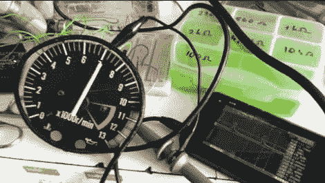

# 垃圾场拾荒网一个转速表玩

> 原文：<https://hackaday.com/2012/07/02/junkyard-scavenging-nets-a-tachometer-to-play-with/>

我们从未想过去汽车废品站寻找可以玩的电子产品。但是[Istimat]能够从一个被毁坏的摩托车仪表板上取出这个运转的转速表。川崎部件的背面只有三个引脚。通过将 12V 连接到 IGN 引脚，接地到 GND，并在未标记的何频上轻敲 12V 电线，能够使针跳舞，并知道他得到了一些东西。

他为这个项目选择的微控制器是 Arduino 板。但 5V 逻辑电平不会输出驱动器件所需的方波。在网上搜索后，他找到了一个双晶体管电路，这让他得到了视频中看到的结果。他的计划是增加使用 Arduino 从任何来源获取数据并显示在表盘上的功能。那张显示所有 CPU 负载读数的[电脑桌立刻浮现在脑海中。](http://hackaday.com/2012/06/30/computer-desk-literally/)

你认为方波电路比必要的更复杂吗？只用一个 NPN 晶体管和一对电阻就能做到吗？

[https://www.youtube.com/embed/ySFnJYeZqqY?version=3&rel=1&showsearch=0&showinfo=1&iv_load_policy=1&fs=1&hl=en-US&autohide=2&wmode=transparent](https://www.youtube.com/embed/ySFnJYeZqqY?version=3&rel=1&showsearch=0&showinfo=1&iv_load_policy=1&fs=1&hl=en-US&autohide=2&wmode=transparent)