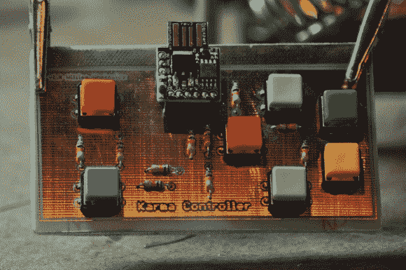

# Karma 控制器让 Reddit 成为一款游戏

> 原文：<https://hackaday.com/2013/05/08/karma-controller-makes-reddit-a-game/>

[威尔]非常喜欢 Reddit[,他设计了这个专用控制器](http://willmakesthings.com/karma-controller/),让他可以像玩视频游戏一样玩这个社交网站。

他称之为因果控制器。在这种情况下，“因果报应”指的是在 Reddit 帖子上积累大量净投票的能力。这款设备有七个按钮，可以上下投票，上下浏览 Reddit 列表，切换图像，以及打开和关闭评论区的新标签。我们想知道它是否允许你跟踪文章来源的链接？

我们以此为特色的原因之一是，这只是[威尔的]第二个电子项目。如果你仍然不愿意弄脏你的手，我们希望这能成为你的灵感。他首先在一大块原型板上制作了第一个版本。顶部的 Digispark 微控制器读取他的按钮网络，并通过 USB 与电脑通信。一旦设计被证明，他得到了一些帮助蚀刻这个电路板，这是第二版。他在跳跃后的片段中展示了这一点。

如果你只是想要一些投票按钮，你应该[看看这个项目](http://hackaday.com/2011/07/30/usb-reddit-upvotedownvote-button/)，它包括一个 3D 打印的外壳和按钮盖。

[https://www.youtube.com/embed/SMjkqssMEds?version=3&rel=1&showsearch=0&showinfo=1&iv_load_policy=1&fs=1&hl=en-US&autohide=2&wmode=transparent](https://www.youtube.com/embed/SMjkqssMEds?version=3&rel=1&showsearch=0&showinfo=1&iv_load_policy=1&fs=1&hl=en-US&autohide=2&wmode=transparent)