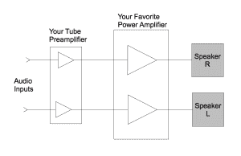
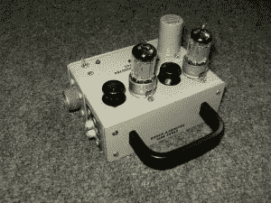
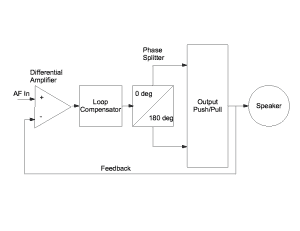
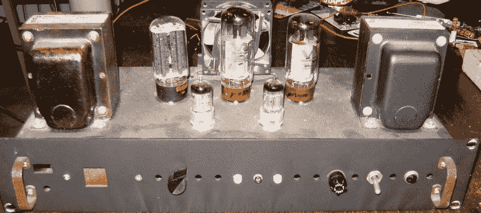
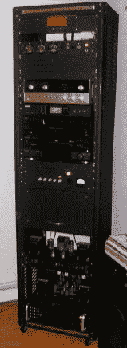
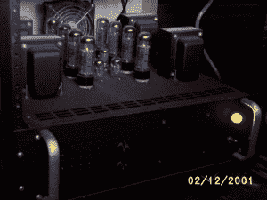
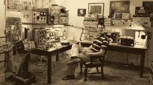

# 让那些灯丝一直亮着，设计你自己的真空管音频设备

> 原文：<https://hackaday.com/2014/06/04/keep-those-filaments-lit-design-your-own-vacuum-tube-audio-equipment/>

那是芝加哥一月的一个寒冷的星期六晚上，我们有重大的计划。巴迪·盖伊的传奇酒吧挤满了人。我们直接安装在离舞台不到 15 英尺的一个扩音喇叭下面。庆祝的时间到了。跳过杯子，一人一罐，继续上。我们将创造盗版录音的历史。对话演变成了关于我们的封面会是什么样子的讨论，当然会是最近在我的地下实验室里制作的电池供电的电子管麦克风前置放大器的照片。在巴迪出现之前，我们有四个小时可以消磨。我们在鹅岛和吉尼斯的消费率将使我们在 11 年前达到 3 张。必须专注。是时候了，巴迪上场了。许多摸索和忘记如何打开日本制造的 24 位数字录像机及其嵌套的液晶菜单，神秘的按钮，和 90 年代后期的固件。让它发挥作用。我们做到了，正好让保镖们注意到了麦克风和电池组。等等，等等…也许我们应该先谈谈为什么电子管放大器值得这么麻烦。

是的，真空管听起来确实比晶体管好(在你讨厌评论之前[看看这篇关于主题](http://spectrum.ieee.org/consumer-electronics/audiovideo/the-cool-sound-of-tubes)的学术文章)。难点是成本；tube gear 非常昂贵，因为它使用大量铜、铁，通常由手工进行点对点布线，并需要一个重金属底盘来支撑所有这些部件。但是，随着这种高成本而来的是建造自己的装备的良好经济合理性。

### 这是真正值得去做的 DIY 的最后领域之一。

真空管通过热离子发射来工作，这意味着电子是由真空下非常热的东西发射出来的。在这种情况下是灯泡灯丝或加热包围灯丝的阴极金属板的灯泡灯丝。这些电子从阴极加速到极板，从而使电流从阴极流向极板。这种电流由控制栅控制，控制栅实际上是阴极和板之间的小金属丝网，看起来像窗纱。实际上，栅极类似于场效应晶体管的栅极，尽管物理性质完全不同。有一些爱好者实际上[从零开始制作自己的电子管](https://www.youtube.com/user/glasslinger)。

真空管音频电路很容易发出声音。电子管电路有助于自偏置和简单的一阶近似。今天购买零件，周日晚上收听吉米·亨德里克斯的音乐。

#### 简单单级电子管前置放大器的工作原理

Preamplifier. An example of a 20 dB audio gain stage.

音频输入直接馈入 V1 的电网，该电网也通过电阻器 R1 分流。R1 的工作是将 V1 的栅极拉至 0V 电位，同时为音频输入提供终端阻抗(大多数情况下为 50K 或 100K)。R2 和 R3 设置增益和偏置点。假设电子管具有“高μ”,电压增益的简单近似值是 R2/R3。mu 衡量跨导或电子管的放大能力，即电流输出/电压输入。流过电子管的电流吸收 R3 上的电流。该电路空闲(或未放大)时，R3 两端的电压等于偏置电压。这种配置被称为“自偏置”。老工程师会告诉你，用电子管设计比用晶体管容易。他们是对的。

输出与 C1 交流耦合，以阻止板电压馈入该电路的任何线路。像单级晶体管放大器一样，输出是反相的**，**栅极电压上升导致极板电压下降。

#### 启动它

Schematic of 120 VDC power supply with regulation.

你将需要 50-150 伏的 B+(或板电压，因为它通过 R2 连接到电子管的板)和大约 1 毫安来给这个前置放大器供电。您可以通过以下电路实现这一点，该电路使用齐纳二极管提供稳定的 120 VDC 电压。

With two pre-amps you can make a stereo preamp or ‘hybrid’ power amplifier.

必须注意，电子管是高电压低电流的，从传统/现代电路设计的角度来看，电阻似乎很高，电容很低，电流调节充其量只能达到业余水平。这个电源管用，因为我们只需要 1 mA。

#### 做两份

将输入连接到您的音频源，将输出连接到您喜欢的固态放大器。我们现在有一个“混合放大器”，包含一个电子管前端和一个固态后端。这种放大器的专业版本由一家大型消费电子产品制造商出售。

#### 把它带在路上，一个来自我大学经历的真实故事

Battery operated portable tube preamp.

回到我之前开始的故事。我和我的私酒同谋者们喝得酩酊大醉，正准备获得迄今为止现场音乐会的最佳录音，这时我们被保镖拦住了。经过短暂的审问后，我们被赶了出来，回到了寒冷的街道上，但带着一种满足感，尽管我们没有录制节目，但我们有镇上最好的音频设备:

Schematic of battery operated tube preamp.

在该设计中，上述两个前置放大器与电池供电的高压电源一起使用。高压电源的工作原理是用 555 定时器产生方波。这个方波高于可听频率，约为 40 千赫。方波馈入一个小型音频功率运算放大器。该运算放大器的输出反馈到音频输出变压器的次级，产生 40 Khz 的 170V 交流高压。该信号以常规方式进行整流、滤波和调节。整个系统依靠 8 节 AA 电池运行，应能连续运行约 4 小时。你需要自己制作的所有东西都在这个 PDF 文件中。

#### 功率放大器

最终你可能会想要创造一个功率放大器。电子管音频功率放大器有许多种类和变体:

*   B 类是推挽放大器，类似于传统的固态放大器，其中有一个推管和一个拉管被驱动 180 度异相。
*   AB 类是偏置的，以便输出设备始终开启，从而减少或消除当一个电子管将负载移交给另一个电子管时发生的交叉失真。
*   A 类放大器基本上是我们上面前置放大器的高功率版本，而不是电阻 R2，我们有一个音频输出变压器。在 A 类放大器中，不必要地消耗了更多的功率，因为它们总是开启的，它们要么释放负载，要么将负载拉至接近 0 电位。当什么也不做的时候，他们就半旗致哀，消耗大量的能量。许多人更喜欢 A 类，因为没有交越失真，而且设计非常简单。
*   更模糊的放大器类型包括无变压器，其中许多电子管并联在 A 类配置中，直接驱动 4-8 欧姆的扬声器负载。

几乎所有的电子管放大器都需要一个变压器来匹配电子管的高阻抗(3K 左右)和现代扬声器的低阻抗(4-8 欧姆)。

Block diagram of a typical tube power amplifier.

反馈可以应用于所有类型的放大器，就像运算放大器电路一样，一些输出信号反馈到输入端，允许放大器补偿非线性。反馈提供了更清晰的信号和更好的性能。根据你的目标，这并不总是可取的。没有反馈时，总谐波失真预计在 7%左右。带反馈和高增益时，总谐波失真预计为 0.5%。

Schematic of a class AB tube power amplifier with negative feedback.

典型的电子管功率放大器是带反馈的 AB 类。其中有一个增益级，当反馈环路闭合时，它还充当差分放大器。接下来是所谓的“分相器”，它基本上是一个缓冲器或少量增益，使用两个三极管提供同相和异相输出。两路输出分别以 0°和 180°相位驱动输出功率管。输出管推拉输出变压器。电子管只能拉，所以输出变压器由初级绕组的中心抽头供电。最后，输出馈入扬声器，并通过反馈网络馈入第一级。

原理图中显示了这方面的一个工作示例，其中[详细介绍了它的实现](http://glcharvat.com/website%20pdfs/AX_201206_Charvat_ReprintedwPermission.pdf) (PDF)。

#### Tube 家庭影院

借助这些前置放大器和功率放大器电路，您可以将您的设计扩展为具有 5.1 声道的完整家庭影院系统。关于其实现的技术细节，[请看这个 PDF](http://glcharvat.com/website%20pdfs/AX_201205_Charvat_ReprintedwPermission.pdf) 。你也可以看看[我的项目，它是去年年初的特色](http://hackaday.com/2013/01/02/frankenstein-an-all-tube-home-theater-amplifier/)。

    Photo of vacuum tube home theater system.  

#### 让它们发光

Four-channel power amplifier located at bottom of home theater system, this is simply four of the class AB power amplifiers described previously.

就像电视真人秀中熟练的工匠制造摩托车或热棒一样，你也可以定制电子管放大器的外观。[将灯管放在底盘顶部，这样你就可以看到它们发光](http://glcharvat.com/Dr._Gregory_L._Charvat_Projects/Quad_Tube_Amplifier.html)。将输出、电源和扼流圈也放在顶部。玩“月亮的黑暗面”时，看着它们在黑暗中发光很有趣。

#### 哪里可以找到零件

音频管很容易找到，并继续在东欧，俄罗斯，中国和其他国家生产。包括音频输出和电源在内的所有类型的变压器都可以通过 Hammond Manufacturing 和其他来源获得。电子管音频社区的一个新运动是找到模糊的输出变压器对，并制作单端无反馈放大器。最近，制造商已经开始再造高压轴向引线帽和其他老式零件。你可以在[古董电子用品商店](http://www.tubesandmore.com)、[找到这种东西，只是收音机](http://www.justradios.com)，甚至还有 Mouser 和 Digi-Key(同样的东西不太贵，但需要大量的过滤和翻目录)。

#### **学得快**

有很多关于地铁设计的材料，但这些是我个人最喜欢的:

*   无线电管设计者手册。
*   [权力的原则。](http://www.tubesandmore.com/products/B-726)
*   一些 tube audio 社区聚集的地方，[audio express 杂志。](http://audioxpress.com)

在你的下一个音频项目中尝试真空管。让那些灯丝一直亮着。

* * *

 从 2007 年 9 月到 2011 年 11 月，他是麻省理工学院林肯实验室的技术人员，他在穿墙雷达方面的工作赢得了 2010 年 MSS 三军雷达研讨会的最佳论文，并且是 2011 年 Provost 研究亮点的麻省理工学院办公室。他曾在麻省理工学院教授短期雷达课程，他的“构建小型雷达”课程是 2011 年排名第一的麻省理工学院专业教育课程，并被其他大学、实验室和私人组织广泛采用。从早年开始，Greg 开发了许多雷达系统、铁路 SAR 成像传感器、相控阵雷达系统；拥有多项专利；并开发了许多其他传感器、无线电和音频设备。他撰写了许多出版物，并因其作品受到了大量媒体的关注。Greg 于 2007 年获得密歇根州立大学电气工程博士学位，2003 年获得 MSEE 博士学位，2002 年获得 BSEE 博士学位，他是 IEEE 的资深会员，曾在 2010 年、2013 年和 2016 年 IEEE 国际相控阵系统和技术研讨会指导委员会任职，并于 2010 年至 2011 年担任 IEEE AP-S Boston 分会主席。