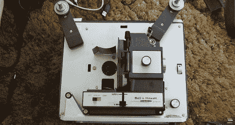

# 用高功率发光二极管让旧的 8 毫米投影仪继续工作

> 原文：<https://hackaday.com/2012/05/24/keeping-an-old-8mm-projector-alive-with-high-power-leds/>

旧的家庭电影和 8 毫米胶片有一种神秘感；无论是 40 年前家庭聚会的镜头，还是你 12 岁时制作的定格动画，电影的即时性是你家第一台便携式摄像机的 VHS 磁带无法比拟的。[特斯拉斯小胡子]一直对 8 毫米相机和投影仪感兴趣，所以当他[发现一台 8 毫米/super 8 投影仪需要一个灯泡](https://thingsihack.wordpress.com/2012/05/22/replacement-8mm-projector-bulb-from-super-bright-led-and-old-cellphone-charger/)时，他知道他手上有一个有价值的项目。

为了更换烧坏且非常昂贵的白炽灯泡，[Teslas]从 Jameco 采购了一种非常亮的星形 LED。这种 1 瓦的 LED 发出的光足以将一帧胶片投射到屏幕上，幸运的是，它不会像普通灯泡那样发热。

为了给 LED 供电，[Teslas]使用了一个由 120 VAC 白炽灯插座供电的手机充电器来为 LED 提供必要的 5 伏 1 安培的电源(欧姆定律适用于咖啡)。现在，仍然需要制造一个漂亮的外壳来将 LED 和充电器安装在灯泡插座上，但一旦[特斯拉斯]解决了这个问题，他就会有一个非常好的 8 毫米投影仪了。