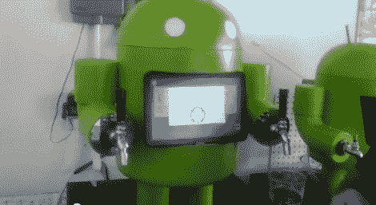

# KegDroid 让喝啤酒变得更有趣

> 原文：<https://hackaday.com/2012/11/08/kegdroid-makes-drinking-beer-more-fun/>

你厌倦了只喝啤酒吗？你的朋友是不是经常溜进你家偷你的神圣饮料？如果是这样，也许你需要[keg droid](http://www.youtube.com/watch?v=2pj8FHxzFvI&feature=plcp)——[保罗·卡夫](http://www.youtube.com/user/pcarff?feature=watch)发明的安卓控制啤酒龙头。

为了给喝啤酒增添更多刺激，[Paul]用一点额外的技术增加了他的水龙头的味道。他添加了一个 Android 平板电脑，用于触摸屏导航菜单，一个 Arduino，用于控制流量传感器和电磁阀，以及一个 NFC 读卡器，作为限制访问的安全措施。用户在被允许倒酒之前必须被认证。

当你登录时，你的名字和照片会从你的 Google+账户中调出，然后你只需选择你喜欢的饮料，如果你喜欢一盎司、八盎司或十二盎司的话。当您达到所需数量时，流量传感器会自动关闭。

看起来你得到的泡沫比啤酒多，但总而言之，这是一个很酷的酒吧顶部应用程序。

休息之后请看视频。

[https://www.youtube.com/embed/2pj8FHxzFvI?version=3&rel=1&showsearch=0&showinfo=1&iv_load_policy=1&fs=1&hl=en-US&autohide=2&wmode=transparent](https://www.youtube.com/embed/2pj8FHxzFvI?version=3&rel=1&showsearch=0&showinfo=1&iv_load_policy=1&fs=1&hl=en-US&autohide=2&wmode=transparent)