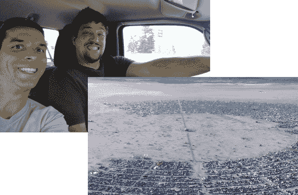

# [肯尼斯·芬尼根]史诗《燃烧的人》幻灯片

> 原文：<https://hackaday.com/2013/09/05/kenneth-finnegans-epic-burning-man-slideshow/>

无论你是否设法参加今年的火人节，我们都非常确定你会喜欢阅读[(肯尼斯·芬尼根的)表演并讲述这个活动](http://blog.thelifeofkenneth.com/2013/09/my-first-burn.html)。这是他第一次参加。除了他那稚嫩的兴奋(这真的是写这种东西的唯一方法)我们永远不会知道他不是一个经验丰富的老手。从他和他的朋友(马塞尔)一起打包的东西，到他参观的景点，他都做得很好！

两人在前往黑岩城的卡车上自拍，黑岩城是内华达州沙漠中每年为《火人节》而兴起的社区。拥挤的交通在偏僻的地方令人惊讶，但当你发现 BRC 今年拥有约 68，000 名居民时，这就不足为奇了。[Kenneth]花了一些时间谈论他们建立的营地，包括绰绰有余的太阳能，以及一个代替电话服务的业余无线电设置。这些流入了他偶然发现的很酷的艺术收藏中，其中大部分规模巨大。甚至有一个机场，这就是他如何能够拍摄上面的航拍照片。

我们认为他回忆中最酷的部分是对‘城市生活’的看法。有夜总会、保龄球馆、广播现场采访和主持脱口秀的电台、咖啡馆等等。八月底在沙漠中闲逛可能听起来不像你的事情，但阅读[肯尼斯的]奥德赛让我们认为燃烧的人就像黑客的迪士尼乐园。