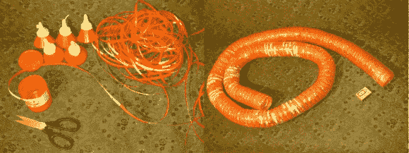

# 番茄酱瓶…柔性软管？

> 原文：<https://hackaday.com/2014/02/17/ketchup-bottle-flexible-hose/>

需要一个波纹软管为您的数控机床？你可以买一个…或者你可以用胶带和番茄酱瓶子自己做一个！

我们的一个线人在一个俄罗斯 3D 建模网站上偶然发现了一个非常有趣的黑客，该网站出售准备进行 CNC 加工的 3D 模型。他们有[几篇关于数控机床的文章](http://3d.kadatka.ru/articles/index_eng.php)，这是其中之一。制作自己的软管的巧妙方法——在这种情况下，用作数控机床上的真空回路。

这很简单，虽然我们预计所涉及的劳动力会很快超过一些廉价软管的成本——但这是回收利用，所以嘿！你首先要找到一个圆柱形塑料容器的来源，比如番茄酱瓶。然后你从这些瓶子上剪下一条永无止境的带子，然后用一个圆柱形的模板(像一罐喷漆一样)，用包装带把有粘性的一面朝外包在模板上。现在把你的丝带缠绕在模板上，稍微隔开一点，然后用胶带把外面也包起来。一瓶一升的番茄酱可以制成大约半米长的波纹软管。通过将软管从罐子上滑下来，并在适当的位置缠绕更多的丝带和胶带，并不难继续这样做。

现在这是一个黑客。

[谢谢迈克尔！]