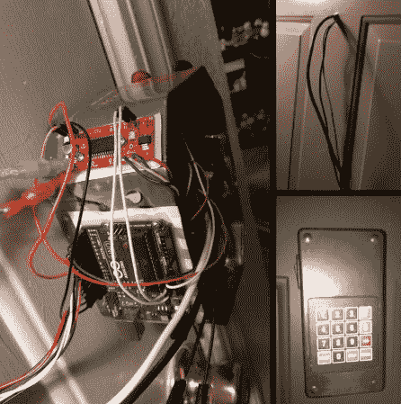

# 钥匙密码门锁不会危及您的安全存款

> 原文：<https://hackaday.com/2012/09/20/key-code-door-lock-wont-endanger-your-security-deposit/>

大学生们成群结队地回到校园里的宿舍和公寓。因此，每年的这个时候，我们通常会开始看到一些编码进入黑客。[Charmonkey]最近在他的新公寓接受了挑战。尽管有一些警告。他需要确保房东仍然可以使用钥匙进入，他不想以任何方式改变门或门框。他想出的是一个可以转动插销的密码进入系统。

为了在门上安装一些五金件，他拆除了固定螺栓组件的内部，并使用相邻锁部分上的一对螺纹管作为锚固点。这使他用作项目箱的口袋妖怪罐安全就位。其余的部件都安装在上面。这些包括驱动锁闩的步进电机、手动操作开关、Arduino 和电机驱动板。

他在键盘上很有创造力。连接它的电线穿过门的窥视孔，进入较小的塑料项目盒，该项目盒容纳其余的硬件。

[via [Reddit](http://www.reddit.com/r/arduino/comments/1056cl/nothing_groundbreaking_just_a_keypad_controlled/)