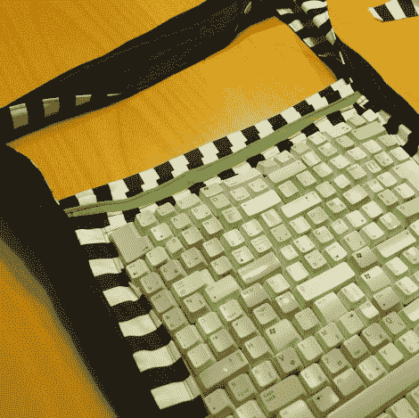

# 按键覆盖的纺织品

> 原文：<https://hackaday.com/2012/07/24/key-covered-textiles/>

[Karolina]一直在努力工作，为她的包包增添一些特色。嗯，实际上很有天赋。她把相当于几个键盘的按键滚进这个包的面板中。她在一本杂志上看到了这个想法，决定试一试。秘诀就是用订书钉。

第一个问题是收集足够的键盘，所以如果你尝试一下，一定要让你的朋友知道你在找旧键盘。接下来，她希望每个键都平放在织物面板上，这意味着切掉延伸超过键边缘的塑料钉。从那里[Karolina]开始设计，每个按键面朝下。注意她是多么小心地确保它们之间没有缝隙。现在是时候把它们连接在一起了。她用重型订书钉作为连接支架。它们被弯曲以在每个键面的下侧提供大的胶合表面。订书钉就位后，可以用一圈线缝到布料上。虽然她在秋天就开始了这个项目，但她现在正在展示完成的包包。