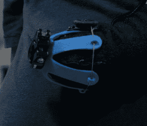

# 一个孩子在夏令营设计了自己的假肢

> 原文：<https://hackaday.com/2014/12/07/kid-designs-his-own-prosthetic-arm-at-a-summer-camp/>

听说过名为超级英雄机器人的夏令营吗？在那里[克比·昂格尔]遇到了 9 岁的[艾丹·罗宾逊]，并帮助他设计了自己定制的义肢。

[营地](http://kidmob.org/superhero-cyborgs/)是由 [KIDmob](http://kidmob.org/) 为有各种肢体残疾的孩子开办的，帮助他们获得工具和指导，使他们能够制作自己的假肢。孩子们提出的一些设计很酷、有用、漂亮，有时并不过分实用——但[艾丹的]设计真正引起了[克比]的兴趣，他是一名设计师，也是由欧特克运营的世界级制造工厂[9 号码头](http://www.instructables.com/id/Overview-Access-to-Autodesk-Pier-9-Workshop/)的工作人员。

儿童假肢有很多问题。它们非常昂贵，孩子们不会保持同样的体型，即使它们可能很贵，它们也不一定工作得那么好。[Aidan]有一些商业选择，但他不喜欢其中任何一个，以至于他宁愿不穿它们。但是当他参加夏令营时，他意识到他有能力设计一个他真正想穿的假肢。

[Aidan]想要一个可以使用不同附件的假肢，具体到他想做的事情，灵感来自瑞士军刀。他希望能够玩 Wii，组装乐高，吃东西，甚至演奏乐器。他的妈妈希望义肢能够和艾登一起“成长”。一项艰巨的任务？也许吧，但是[克比]已经准备好迎接挑战了。

实际上这相当巧妙。[克比]设计了一个花形塑料片，可以 3D 打印，然后在温水中热成型，形成肢体末端。

为了收紧它，他从一个可调节的膝带上偷了一个棘轮调节系统，允许快速安装和拆卸——这是[Aidan]自己可以做到的。

这样，随着他继续成长，假肢仍然是可调节的，最坏的情况下，只需要一个新的 3D 打印部件。为了允许连接各种工具，[克比]增加了一个快速释放夹紧系统，旨在夹持任何直径为 1/2 英寸的轴，使[艾丹]和他的妈妈可以非常容易地制作自己的附件。

[https://player.vimeo.com/video/112131677](https://player.vimeo.com/video/112131677)

3D 打印正在为假肢做一些伟大的事情。今年早些时候，我们看到了一个以钢铁侠为主题的义肢来实现孩子们的梦想，一个关于某人[为一个随机的陌生人](http://hackaday.com/2014/08/27/3d-printing-a-beautiful-prosthetic-hand-for-a-stranger/)制作艺术义肢的可爱故事，以及一个致力于 DIY 义肢的社区 [E-nable](http://hackaday.com/2014/03/15/e-nableing-shea-to-build-a-prosthetic-hand-for-herself/) 的推出——向世界伸出“援助之手”。

【谢谢杰罗姆！]