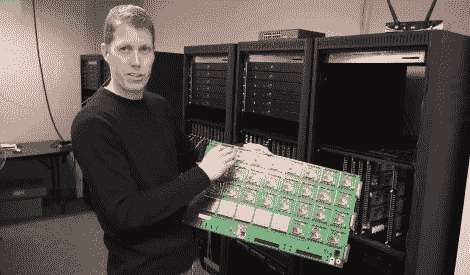

# 千节点:如何测试一个巨大的 Xbee 网状网络

> 原文：<https://hackaday.com/2012/05/31/kilonode-how-to-test-a-huge-xbee-mesh-network/>

假设你是 Xbee 团队的一名开发人员。您需要测试 RF 无线电模块在大型网络中的极限性能。但是除了众多的节点之外，您还需要测试距离对无线电的影响。由于将数百个设备(每个都有自己的电源)分布在整个城镇是不合理的，所以您建立了一个测试设置，如项目经理 Jared Hofhiens 正在展示的 1 千节点 Xbee rig。

他拿着机架安装系统中的一个刀片。这些方块中的每一个都是 Xbee 模块，有 32 个刻在板上。在离他最远的边缘，有一组与机架连接器匹配的连接器，将刀片连接到一组终端服务器。这些服务器允许开发人员 ssh 到单独的模块中。在叶片的近侧有一组衰减调节电路。它们允许以 10 dB 的增量调整 0-40 dB 的衰减，以调整 RF 信号的强度，模拟模块之间的距离。

这些卡中的 32 个安装在上面看到的三个机架中，组成 1024 模块节点。我们真的很欣赏这幕后的样子，并认为你会喜欢休息后的视频之旅。如果它让你想要更多，看看[一家公司如何建立云存储](http://hackaday.com/2009/09/04/how-a-storoage-company-builds-their-own/)。

[https://www.youtube.com/embed/QeSvAn-YRSE?version=3&rel=1&showsearch=0&showinfo=1&iv_load_policy=1&fs=1&hl=en-US&autohide=2&wmode=transparent](https://www.youtube.com/embed/QeSvAn-YRSE?version=3&rel=1&showsearch=0&showinfo=1&iv_load_policy=1&fs=1&hl=en-US&autohide=2&wmode=transparent)

[谢谢克里斯]