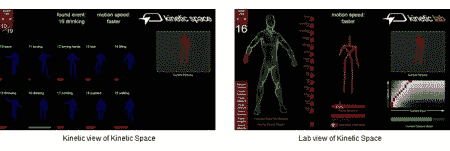

# kinetic Space:Kinect 项目软件

> 原文：<https://hackaday.com/2012/06/11/kinetic-space-software-for-your-kinect-projects/>

对于那些发现自己想用 Kinect 控制一些东西，但不知道该怎么做，或者如何从中获取数据的人来说，你们很幸运。 [Kineticspace 是一款适用于 Linux/mac/windows 的工具](https://code.google.com/p/kineticspace/)，它为您提供了快速、轻松设置手势控制所需的工具。正如你在下面的视频中看到的，设置起来相当简单。你做你的动作，设置每个身体部位的影响量(基本上告诉它忽略什么)，并保存手势。这个系统已经被大量的项目使用，现在已经发布了 2.0 版本。

创造者马蒂亚斯·沃尔费尔告诉我们。他的新功能亮点包括:

*   *可以轻松训练*:用户可以通过记录要检测的动作/手势来简单地训练系统，而无需编写一行代码

*   *是否独立于个人*:系统可以由一个人训练，其他人使用

*   *与方向无关*:即使经过训练和测试的手势不具有相同的方向，系统也可以识别手势

*   *与速度无关*:系统还能够识别手势是否比训练时更快或更慢，并能够提供这一信息

*   *可调整*:手势配置可完全由图形界面控制(2.0 版)

*   *可分析*:当前输入数据可与特定手势进行对比；针对每个身体部位给出手势之间相似性的反馈

[https://www.youtube.com/embed/bj9pME4zrV4?version=3&rel=1&showsearch=0&showinfo=1&iv_load_policy=1&fs=1&hl=en-US&autohide=2&wmode=transparent](https://www.youtube.com/embed/bj9pME4zrV4?version=3&rel=1&showsearch=0&showinfo=1&iv_load_policy=1&fs=1&hl=en-US&autohide=2&wmode=transparent)