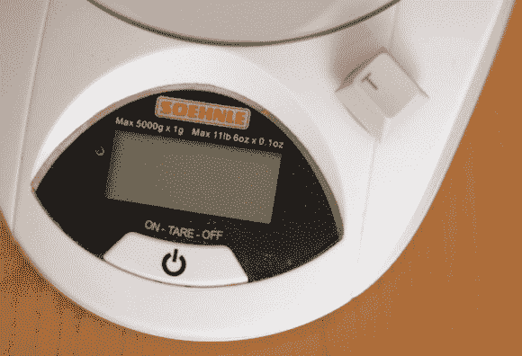

# 厨房秤钥匙移植

> 原文：<https://hackaday.com/2013/01/14/kitchen-scale-key-transplant/>

[Markus]对他的厨房秤非常满意。这是他做饭时最常用的工具之一。但是最近按钮开始给他带来麻烦。他认为，这些年来，这一点点和那一点点的泄露，已经搞乱了联系。他的解决方案是[使用 Cherry MX 开关](http://www.jave.de/blog2/?p=159)绕过按钮。

实际上，任何替换都可以，因为开关只是完成一个电气连接。但是有一部分黑客相信一些键盘上的樱桃 MX 开关。[Markus]手头就有这样一个键盘，他已经用它来做零件了，所以他拔出开关，在秤的外壳上切了一个孔，这样他就可以安装它了。在临时用强力胶将开关粘住之后，他用热胶水填充了外部的缝隙，然后沿着内部涂上另一层胶水，完成了这项任务。添加“T”键完成了破解。塑料钥匙易于清洁，有助于去除面粉、油或他在烹饪冒险中可能溅出的任何东西。

这种破解既快速又简单，可能已经说服了[Markus]为该设备开发自己的控制板。我们将继续关注后续帖子，详细介绍这些改动。