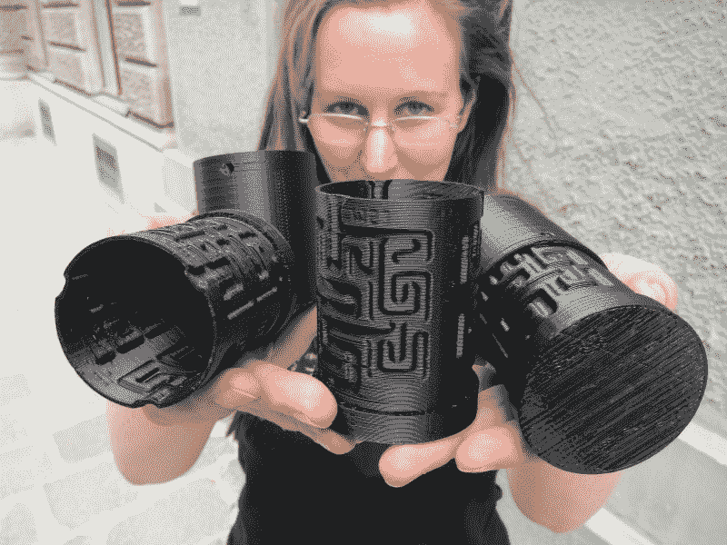

# 资助黑客空间的工具包

> 原文：<https://hackaday.com/2012/04/23/kits-to-fund-hackerspaces/>

[Overflo]最近向我们透露了关于 [HackerspaceShop](http://www.hackerspaceshop.com) 的消息；他计划通过创建一个电子设备市场来资助维也纳和欧洲的黑客空间。我们的想法不仅是销售工具包，而且还为其他人通过该平台销售自己的工具包创造了一种简单的方式，如果你问我们，这是非常棒的。

他们送我们玩的套件是由 metalab hackerspace 的[daniel schatzmayr]开发的太阳追踪花。总的来说，这是一个非常棒的套件，非常适合任何极客女友，当然，它是由 arduino 控制的。这是好是坏由黑客来决定，但是它有一个 FTDI 头；这是我们个人希望在更多的电子套件上看到的。

目前，他们的网站上没有太大的目录，但是嘿，wickedlasers 开始是一个卖改良激光笔的人，Hewett Packard 开始是两个卖更好的函数发生器的人。当一个黑客利用他们的技能成为一名企业家时，这总是令人敬畏的，尤其是为了一个好的事业。

祝你好运！