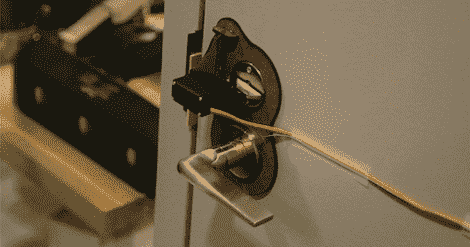

# 敲锁阻止敲击，使用无冲击的盖子

> 原文：<https://hackaday.com/2012/08/06/knock-lock-balks-knock-uses-capsense-without-shock/>

[Rob Hemsley]发送了一个基于 RFID 的门锁的更新。以前，如果你想进入麻省理工学院的媒体实验室，需要一张 RFID 卡。现在，有了[Rob]的更新，你只需要[以一种‘秘密’的模式](http://www.robhemsley.co.uk/knock_lock.html)轻敲门把手。

早期支持 RFID 的构建使用了大约 80 美元的硬件，这不是一个非常经济的解决方案。新的基于触摸的解决方案仅使用 Arduino 和伺服，使构建成本更低。

触摸感应锁使用 CapSense Arduino 库。通过把门把手变成一个触摸传感器，[罗布]允许一个秘密代码保存在 EEPROM 中。当门被锁住时，重复这一序列向伺服机构发送功率，解锁门。

一个非常酷的建筑，也比传统的声音敲锁更安全一点。休息之后请看视频。

[https://player.vimeo.com/video/46799721](https://player.vimeo.com/video/46799721)