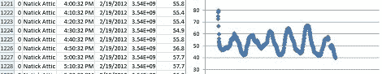

# 克努特记录数据，发送到你的电子邮件

> 原文：<https://hackaday.com/2012/06/24/knut-logs-data-sends-it-to-your-email/>

[Richard]和[Jay]需要一个 WiFi 连接的数据记录器，用于远程监控水族馆。经过三年的辛勤工作，他们终于完成了。虽然 Knut 最初被设计用来监视一些大型水族馆，但它完全有能力记录各种数据，并将这些传感器读数发送到你的电子邮件地址。

Knut 是一个支持 WiFi 的小型设备，配有几个插头，用于温度、湿度、加速度计和其他传感器。所有这些数据都直接进入 Knut 的内存，当内存满了，数据就被发送到一个电子邮件地址。作为奖励，还有一个 iDevice 应用程序(Android 和 Windows 即将推出)来解析生成的。CSV 文件并在 iPhone 上显示结果

对于我们的口味来说，Knut 可能有点贵，但如果你正在寻找一种现成的解决方案来发送警报，记录数据，或者只是通过 WiFi 读取一些传感器，Knut 可能就是合适的选择。

[Richard]和[Jay]制作了一个演示视频，展示了 Knut 应用程序的功能和操作；休息之后请继续关注。

[https://www.youtube.com/embed/egr2HtnYJSQ?version=3&rel=1&showsearch=0&showinfo=1&iv_load_policy=1&fs=1&hl=en-US&autohide=2&wmode=transparent](https://www.youtube.com/embed/egr2HtnYJSQ?version=3&rel=1&showsearch=0&showinfo=1&iv_load_policy=1&fs=1&hl=en-US&autohide=2&wmode=transparent)