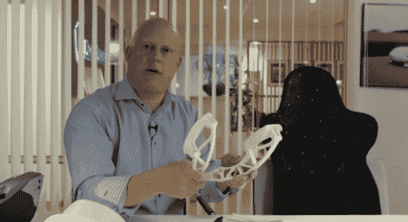

# 科尼赛克生产车辆的 3D 打印

> 原文：<https://hackaday.com/2014/05/10/koenigsegg-3d-printing-for-production-vehicles/>

看到[一家汽车制造商使用 3D 打印技术](http://www.youtube.com/watch?v=Dw6cs7opvzA)，我们并不感到惊讶，但我们认为这可能是我们第一次听说 3D 打印技术进入生产车辆。如果你是英国广播公司*Top Gear*的粉丝，你可能听说过克里斯蒂安·冯·科尼赛克的汽车，在这部电影中，超级跑车一路高歌猛进，领先圈速。

现在，这家瑞典汽车制造商似乎已经将 3D 打印和扫描整合到了设计流程中。克里斯蒂安自己解释了这两种方法对迭代设计的好处:他们制作了一把椅子，一边做一边调整，直到形状合适、舒适为止。然后，他们使用激光扫描仪将其导入 CAD 文件，这大大加快了生产过程。他还拿了一些 ABS 打印的刹车踏板样品——他们通常用铝来加工——来测试适合度和感觉。他们对印刷品进行必要的调整，有时用手雕刻，然后再次打开激光扫描仪捕捉任何修改，将其带回 CAD，并重新打印模型。

有趣的是，他们几年来一直在用 ABS 为量产车打印一些零件。考虑到他们的工作量很小，这是有道理的。视频和更多信息后，跳转。

第一个视频显示了一台[Dimension 1200 es](http://www.stratasys.com/3d-printers/design-series/performance/dimension-1200es)——一台 3 万美元的打印机——在后台辛苦工作，大概是在制作他们的一些 ABS 测试件。第二个视频描述了另一个 3D 打印的构建，这次是用金属来构建一个两相涡轮增压器。定制 turbo 有两个相互缠绕的腔室，柔性壁可以弯曲以优化流量。科尼赛克声称，他们可以通过大量的试验和错误来铸造它，但 3D 打印复杂的形状更快更容易。他们在内部打印移动部件，这样就不用组装了。甚至连安装涡轮增压器的螺纹都被打印出来了，所以一个接近完成的涡轮增压器从打印机里滚出来，准备装上螺栓。

[https://www.youtube.com/embed/Dw6cs7opvzA?version=3&rel=1&showsearch=0&showinfo=1&iv_load_policy=1&fs=1&hl=en-US&autohide=2&wmode=transparent](https://www.youtube.com/embed/Dw6cs7opvzA?version=3&rel=1&showsearch=0&showinfo=1&iv_load_policy=1&fs=1&hl=en-US&autohide=2&wmode=transparent)

[https://www.youtube.com/embed/DNedUZxP8NU?version=3&rel=1&showsearch=0&showinfo=1&iv_load_policy=1&fs=1&hl=en-US&autohide=2&wmode=transparent](https://www.youtube.com/embed/DNedUZxP8NU?version=3&rel=1&showsearch=0&showinfo=1&iv_load_policy=1&fs=1&hl=en-US&autohide=2&wmode=transparent)

[谢谢马特]