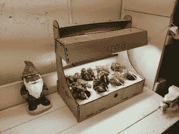

# Kumo Connect:从自动化桌面和后院花园到自动化一切

> 原文：<https://hackaday.com/2014/07/16/kumo-connect-from-automated-desktop-and-backyard-gardens-to-automated-everything/>

二十年前，我在堪萨斯城的创客集会上遇到一个人，我曾和他一起去舀冰淇淋。我们在一个濒临死亡的郊区购物中心的 Baskin Robbins 卖冷冻乳制品，那里的停车场有一个一小时的照相亭。它离我们的家门口足够远，在它的背面点缀上硬冻的冰淇淋球是一项挑战，这些冰淇淋球是被铲起的，然后并不总是意外地掉进冰箱的深处。这个家伙，布莱克，在后屋藏了一根曲棍球棒，就是为了这个目的。我从来没有让他们飞那么远，但他很擅长。

从那以后我就没见过他，他在创客集市的一个摊位前工作。他看起来相当专业，没有表现出那些冰淇淋曲棍球日子里的恶作剧的迹象。他的摊位的主要吸引力是 Niwa，一个相连的室内花园。大学毕业后，布莱克在日本生活和工作了四年，他没有随意选择这个名字:“niwa”是日语中“花园”的意思。他喜欢 Hackaday，非常乐意分享他的故事。

#### 与自然连接

[Blake]是一个狂热的园丁，但他的妻子没有这种热情。几年前，他接受了一份几乎每周都需要出差的新工作，这意味着他的工厂遇到了大麻烦。不幸的是，他找不到他想要的东西来确保他们得到照顾。你知道接下来会发生什么:他决定设计自己的系统。然而，他没有电子方面的经验。

进入 Sparkfun Arduino Inventor 的工具包。一旦他实现了你好，世界，他是不可阻挡的。经过几个月的时间，大量的谷歌搜索和几次原型迭代，他完成了当前的设计。

Niwa 做了几乎所有你想让联网花园做的事情:它测量土壤湿度、相对湿度、环境光、温度和气压。控制器内部是一个定制的 ATMega328 shield，它可以独立工作，也可以安装在 Pi 上，用于网络连接和控制。

他可以通过谷歌日历(Google calendar)按照时间表来设置水，但他更喜欢自己在手机上完成。Pi 向 web 服务发送传感器数据，这样他就可以从他的酒店房间查看图表。Niwa 没有使用任何奇怪或困难的来源，只是很好的 ol' ebay 传感器，如光电池，DHT-11 和 BMP-085 的气压数据。

#### 游园会

一旦他让 Niwa 开始运行，他就将自动化扩展到他更大的室内花园和 25 英尺 x 25 英尺的室外菜园。室内花园使用水族箱泵和水桶浇水。在室外，蔬菜一排排茁壮成长，这些蔬菜被浸泡软管分开，浸泡软管由龙头输送，并由电磁阀控制。三个花园都有 gnome guardians，带有天气传感器和 2.4GHz 无线电，因此他们可以共享英特尔。[Blake]计划整合天气监测，让系统检查降雨预测并相应调整灌溉。

#### 未来之家

一旦他让三个花园都顺利运转起来，[Blake]就想把所有的事情都自动化。他的百叶窗可以根据外面的光线开合。他的狗可以自动喂食。恒温器可以做出决定；如果车库门开着，它会自己关上。邮件来了吗？没人在家时门铃响了吗？他没理由找不到，而且几乎在世界任何地方。

然后[布莱克]看到了一个商机。他带来了一些人来帮助软件开发、营销、制造和设计，于是 Kumo Connect 就诞生了。他们已经建造了许多原型，包括自动喂狗器、智能恒温器和车库门装置。所有这些都是独立的单元，但是能够相互通信。他们设计的其他产品包括自动百叶窗、保险箱和书桌锁。

[Blake]和他的团队即将把 Niwa 作为商业产品发布。不管怎样，他们计划在一切准备就绪的时候发布所有的 CAD 设计和代码。现在，你可以[访问他们的网站并注册更新](http://kumoconnect.com/)。

[Blake]对任何想探索开放硬件和软件、创业先锋或任何介于两者之间的人的建议很简单:和比你聪明的人在一起。特别是，他感谢队友和所有朋友对他的支持。

[图片鸣谢:回到未来，环球影业和安布林娱乐公司]