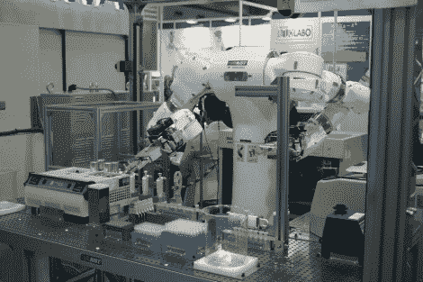

# 实验室机器人展示了对培养和其他任务的掌握

> 原文：<https://hackaday.com/2012/07/27/lab-robot-demonstrates-mastery-of-culturing-and-other-tasks/>

实验室工作是个不错的工作。但是有时在危险的样品周围，或者完成单调重复的任务会让科学家寻找不同的方法。这个机器人似乎知道实验室的路。它背后的人声称它比经验丰富的实验室技术人员更精确，并且它可以在一半的时间内完成任务。

看完视频(跳转后嵌入)后，我们印象深刻。该系统表现出的灵活性体现了对最微小细节的关注。这是因为机器人工作的所有东西都经过了 3D 扫描仪，以建立虚拟模型。这种方式的训练是在电脑上完成的。在机器人真正开始处理传染性物质(如流感病毒和其他不太好的微生物)之前，它可以在任何场景下运行。

我们真正想知道的是使用了什么样的视觉反馈系统。

[https://www.youtube.com/embed/-Stz0pATsXc?version=3&rel=1&showsearch=0&showinfo=1&iv_load_policy=1&fs=1&hl=en-US&autohide=2&wmode=transparent](https://www.youtube.com/embed/-Stz0pATsXc?version=3&rel=1&showsearch=0&showinfo=1&iv_load_policy=1&fs=1&hl=en-US&autohide=2&wmode=transparent)

[通过 [Technabob](http://technabob.com/blog/2012/07/09/mahoro-laboratory-robot/) 和 [Geek](http://www.geek.com/articles/geek-cetera/mahoro-robot-carries-out-dangerous-lab-work-faster-than-any-human-2012078/)