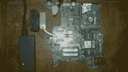
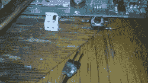
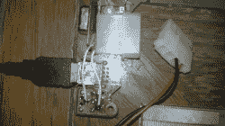
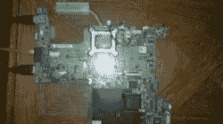
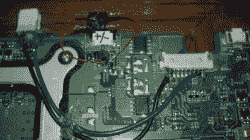

# 笔记本电脑主板重生为低瓦数服务器

> 原文：<https://hackaday.com/2012/11/02/laptop-motherboard-reborn-as-a-low-wattage-server/>

[Darknezz]给我们发了一组照片和一些关于他损坏的笔记本电脑主板变成服务器的细节。一位客户带给他一台 Dell 1525，但液晶屏上什么也没有显示。HDMI 和 VGA 仍然工作正常，他发现问题出在主板上没有信号。他把主板换了出来，让笔记本电脑重新工作，但他的客户说他可以保留损坏的那块。

它有一个双核 CPU，可以满足他的需求，因为它是用电池供电的，所以尽可能节能。[Darknezz]翻遍了他的零件箱，找到了一个能以 3.5A 的电压提供所需的 19.5V 电压的 PSU。连接器不匹配，但他没花太多时间就用一个备用的 Molex 连接器把它插上了。他还需要一个电源按钮，并最终将一个瞬时按钮开关焊接到一对衬垫上，这是他从最初的连接器上找到的。他最终购买的唯一东西是内存模块。看看他在休息后拍的画廊改建的照片。

