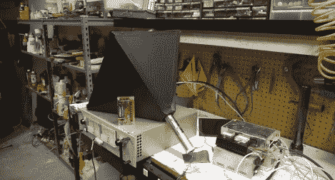

# 大面积 X 射线探测器

> 原文：<https://hackaday.com/2012/11/16/large-area-x-ray-detector/>

这是由[本·克拉斯诺]建造的 x 射线探测器。这是一个与示波器一起工作的有趣的部件组合。结果是一个听得见的滴答声，就像你从盖革计数器中听到的一样

他在测量反向散射，这是 x 射线在其他物体上的反射。因为与 x 射线源直接发出的波相比，信号非常微弱，所以他需要一个大的收集器来测量它们。他从取出 x 光图像增强暗盒开始。它有一层荧光层，当被 x 射线激发时会发光。这个想法是发光的磷光体比直接的 x 射线能更好的曝光胶片。但是[本的]不用胶片。他以磷光材料为基础建造了金字塔形收集器。在金字塔的顶端，他安装了一个光电倍增管(从他的扫描电子显微镜改装而来),可以检测其表面的受激点。他的示波器监控 PMT，然后在校准连接器上发出一个电压尖峰，该电压尖峰被馈送到音频放大器。不要错过休息后他的演讲。

[Ben]提到这个构建是为将来的项目做准备。我们很想听听你认为他在做什么。请在评论区留下你的猜测。

[https://www.youtube.com/embed/B0elgKCuoBg?version=3&rel=1&showsearch=0&showinfo=1&iv_load_policy=1&fs=1&hl=en-US&autohide=2&wmode=transparent](https://www.youtube.com/embed/B0elgKCuoBg?version=3&rel=1&showsearch=0&showinfo=1&iv_load_policy=1&fs=1&hl=en-US&autohide=2&wmode=transparent)