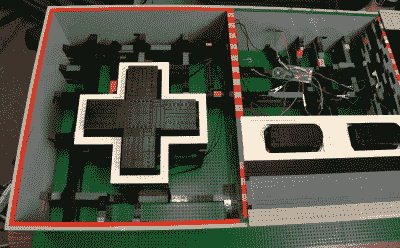

# 乐高大 NES 控制器

> 原文：<https://hackaday.com/2015/05/21/large-nes-controller-made-from-legos/>

如果乐高很酷，异常大的 NES 控制器也很酷，那么[巴伦·冯·布伦克]创造的东西相当酷。这是一个超大功能的 NES 游戏控制器…用乐高做的！是的，你过去(或现在)最喜欢的积木现在可以用来做一个[不必要的大游戏控制器](http://vonbrunk.tumblr.com/post/39417748814/nes)。

控制器外壳的四个主要侧面是标准堆叠的灰色乐高积木。外壳内部大部分是中空的，只有一些用于墙壁和按钮的支撑结构。顶部由 4 块独立的乐高板组成，可以快速轻松地拆卸下来，以接近内部组件。大型乐高按钮在框架内上下滑动，并被支撑在“向上”位置，这是一套技术乐高套件中的减震器。电击产生了一个弹簧按钮，当按下时，会与 Radio Shack 的瞬时开关接触。每个瞬时开关都连接到一个埋在大型复制品中的股票 NES 控制器上。股票控制器线，然后连接到一个 NES 到 USB 适配器，使最终产品与 NES 仿真器在 PC 上工作。

[Baron von Brunk]对 Hackaday 或其他乐高项目并不陌生，看看这个[灯罩](http://hackaday.com/2013/12/14/building-mosaic-lego-lamps/)和[交通灯](http://hackaday.com/2014/01/06/green-light-lego-red-light-stop/)。

[https://www.youtube.com/embed/ocjNqbiUacU?version=3&rel=1&showsearch=0&showinfo=1&iv_load_policy=1&fs=1&hl=en-US&autohide=2&wmode=transparent](https://www.youtube.com/embed/ocjNqbiUacU?version=3&rel=1&showsearch=0&showinfo=1&iv_load_policy=1&fs=1&hl=en-US&autohide=2&wmode=transparent)

[通过[指令栏](http://www.instructables.com/id/Giant-Functional-LEGO-NES-Controller/)