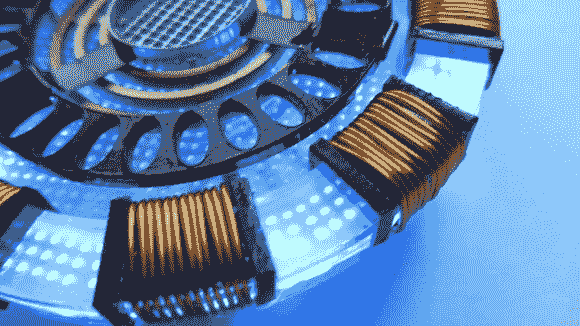

# 激光切割电弧反应器复制品

> 原文：<https://hackaday.com/2013/08/29/laser-cut-arc-reactor-replica/>

我们开始成为电弧反应堆复制品项目的仓库。[上图所示的](http://www.doityourselfgadgets.com/2013/05/homemade-iron-man-arc-reactor-mark-1.html)主要使用激光切割组件。我们在 5 月份的时候错过了，当时瓦伦丁·阿默斯(Valentin Ameres)第一次向我们通风报信。但在本月早些时候看过 3D 打印版的[后，他又把它发了回来。](http://hackaday.com/?s=arc+reactor)

我们最大的抱怨是我们没有自己的激光切割机来进行试验。一切都是从 2 毫米厚的丙烯酸树脂上切割下来的。黑色、银色和铜色的组件被涂上颜色以实现这种外观。许多透明部分还蚀刻了点阵，以帮助光线扩散。

基本的组装只需要把零件粘在一起。最后的润色包括缠绕外环的插槽，添加 led 和限流电阻。

这些计划不是免费提供的，但上面链接的 3D 打印版本可以兼作 123D 教程。如果你足够幸运有时间在激光切割机上，这将有助于你快速设计自己的产品。

[https://www.youtube.com/embed/6jeRf5dAU2Q?version=3&rel=1&showsearch=0&showinfo=1&iv_load_policy=1&fs=1&hl=en-US&autohide=2&wmode=transparent](https://www.youtube.com/embed/6jeRf5dAU2Q?version=3&rel=1&showsearch=0&showinfo=1&iv_load_policy=1&fs=1&hl=en-US&autohide=2&wmode=transparent)