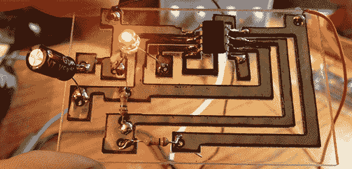

# 激光切割印刷电路板

> 原文：<https://hackaday.com/2013/01/22/laser-cut-pcbs/>

尽管你可能听说过，那些 40 瓦的激光切割机[实际上*可以*在你的下一个 PCB](http://nothinglabs.blogspot.com/2013/01/laser-cut-circuit-boards.html) 上切割出痕迹。

自从一年半前得到他的激光切割机后，在 Nothing Labs 的[Rich]一直试图用它切割 PCB。其他人也尝试过，通常是通过掩蔽一块铜，然后进行化学蚀刻。[Rich]想要一步到位的过程，但是他的激光切割机确实不能胜任切割金属的任务。

当他听说另一个制造商用类似的激光切割机切割 0.001”厚的不锈钢时，这一切都改变了。不锈钢不可焊，但低碳钢可焊。在找到一片非常薄的软钢后，[Rich]将它粘在一张丙烯酸板上，设计了一个简单的 555 blinky LED 电路，并尝试了一项新技术。

事实证明，将非常薄的钢切割成电路轨迹是可能的，并且有足够的通量将它们变成功能电路。作为奖励，最终的电路看起来真的很酷，电路板可以在几分钟内制作完成。

它不适合非常精细的工作——Rich 可以获得的最小走线宽度约为 1/16 ”,但这是制作几个电路原型的非常快速的方法。

[https://www.youtube.com/embed/OtZQoIheYcc?version=3&rel=1&showsearch=0&showinfo=1&iv_load_policy=1&fs=1&hl=en-US&autohide=2&wmode=transparent](https://www.youtube.com/embed/OtZQoIheYcc?version=3&rel=1&showsearch=0&showinfo=1&iv_load_policy=1&fs=1&hl=en-US&autohide=2&wmode=transparent)