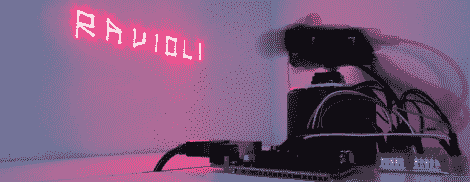

# 激光绘画包括相机控制

> 原文：<https://hackaday.com/2012/07/13/laser-light-painting-includes-camera-control/>

[这个激光灯绘画设置](http://home.ite.sfcollege.edu/~nicholas.topper/final_project/index.html)甚至可以控制摄像机。但它可能不会与你的平均指向和拍摄工作。使用的曝光时间大约为 2 秒，这是除了 DSLR 相机之外很难找到的特征。

该装置依靠红色激光二极管来完成绘画。当实时观看时，你只能看到一个点描绘出一个神秘的图案，偶尔会打开和关闭。但是长时间曝光后，强烈的光线会持续产生上图中的图像。注意快门打开时，装备移动时周围的重影。

Arduino 控制的设备包括一个水平旋转二极管的底座，以及一个瞄准垂直轴的伺服系统。由于草图是按字母划分的，我们想知道将它改编成使用傻瓜相机会有多难？也许你可以一次捕捉一个字母，然后在后期制作时将这些帧分层。

这似乎比我们看过的一些 LED 绘图仪要容易得多。如果你自己制作了[，别忘了给我们发一个链接](http://hackaday.com/contact-hack-a-day/)。

[https://www.youtube.com/embed/Zh_SLco929s?version=3&rel=1&showsearch=0&showinfo=1&iv_load_policy=1&fs=1&hl=en-US&autohide=2&wmode=transparent](https://www.youtube.com/embed/Zh_SLco929s?version=3&rel=1&showsearch=0&showinfo=1&iv_load_policy=1&fs=1&hl=en-US&autohide=2&wmode=transparent)