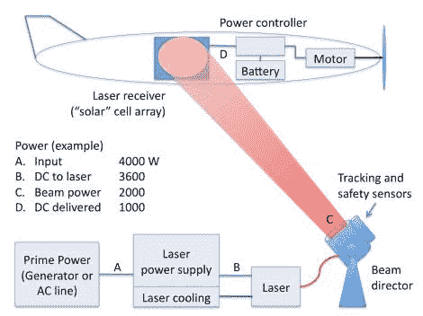

# 激光动力系统让无人机无限期飞行

> 原文：<https://hackaday.com/2012/09/27/laser-power-system-keeps-uavs-flying-indefinitely/>

无人机技术正在推动航空航天业，因为各公司都在试图开发下一个大东西。这里有一个很好的例子来说明我们在谈论什么。激光不能用来无限期地保持无人机在空中飞行。诀窍是添加一组专门调谐到红外激光波长的光伏电池。然后，地面系统将高强度激光束引导到飞机的电池阵列上，以便在飞行中传输能量。

休息之后，你可以观看一段来自贸易展的视频，其中洛克希德·马丁公司的一名员工描述了这种系统的成功测试。但是在 Laser Motive 发布的白皮书中有更多的信息。他们是技术背后的人，他们与 LM 合作实施该系统。地面上的激光装置可以直观地跟踪无人机，但在阴天的情况下也有一种使用 GPS 坐标的方法。

[https://www.youtube.com/embed/Tqwqnj-oGyo?version=3&rel=1&showsearch=0&showinfo=1&iv_load_policy=1&fs=1&hl=en-US&autohide=2&wmode=transparent](https://www.youtube.com/embed/Tqwqnj-oGyo?version=3&rel=1&showsearch=0&showinfo=1&iv_load_policy=1&fs=1&hl=en-US&autohide=2&wmode=transparent)

[谢谢 Bearmos]