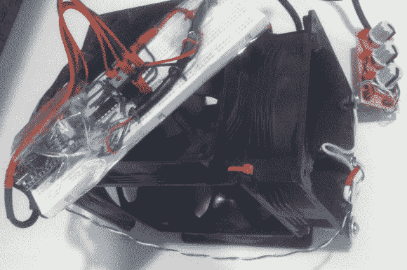

# 激光肺活量描记器

> 原文：<https://hackaday.com/2013/02/21/laser-spirograph/>

这是一个周末垃圾箱项目，如果我们曾经见过的话。[Pat]用四个电脑爱好者制作了他的激光肺活量描记器。当涉及到硬件与微控制器的接口时，决定亲自尝试这个简单的构建将会让您了解很多基础知识。在这种情况下，它是 Arduino Nano。

肺活量描记器的工作原理是将一束激光反射到连接在电脑风扇上的镜子上。当风扇旋转时，轻微的对齐变化会导致激光点以视觉上令人愉悦的方式摆动和编织。休息之后，你可以在短片中看到二十分钟的灯光秀。

其中三个风扇附有镜子，第四个风扇的外壳用于安装激光二极管，使装配更容易。TC4469 电机驱动器用于将风扇连接到 Arduino。灯光表演可以通过旋转三个电位计来手动控制，电位计使用 Arduino 的 ADC 读取。

如果你设法完成了这个建筑，也许你会进入[一个将激光投射到整个房间的装置](http://hackaday.com/2009/09/13/laser-spiro-made-from-junk)。

[https://www.youtube.com/embed/Vumzg-rOBPY?version=3&rel=1&showsearch=0&showinfo=1&iv_load_policy=1&fs=1&hl=en-US&autohide=2&wmode=transparent](https://www.youtube.com/embed/Vumzg-rOBPY?version=3&rel=1&showsearch=0&showinfo=1&iv_load_policy=1&fs=1&hl=en-US&autohide=2&wmode=transparent)