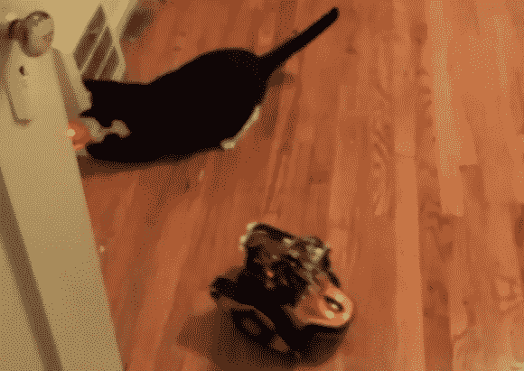

# 激光搬运机器人嘲弄家猫

> 原文：<https://hackaday.com/2013/03/11/laser-toting-robot-taunts-house-cat/>

[罗德尼·莱德雷尔]和他的猫在搬到一个新的城市后感到无聊。他为他们俩解决了这个问题，他接手了这个项目，将一个机器人变成了猫的娱乐。

众所周知，猫对激光笔产生的小红点情有独钟。[Rodney]通过自动移动红色激光笔来实现这一特性。在将它安装到伺服电机上之后，他开始为 Arduino 编程，让它以一种有趣的方式移动。但是，如果它只能预编程模式，那就没什么意思了，所以他还包括了一个红外接近传感器，以帮助赋予它交互性。再加上踏板机器人底座，你就有了移动猫娱乐。证据就在休息后的视频中…这只猫当然很开心地追着那个点。[Rodney]计划在他的代码上多下点功夫，使激光点的运动包含许多不同的模式，让事情保持激动人心。

[https://www.youtube.com/embed/lRB3QOvREjw?version=3&rel=1&showsearch=0&showinfo=1&iv_load_policy=1&fs=1&hl=en-US&autohide=2&wmode=transparent](https://www.youtube.com/embed/lRB3QOvREjw?version=3&rel=1&showsearch=0&showinfo=1&iv_load_policy=1&fs=1&hl=en-US&autohide=2&wmode=transparent)