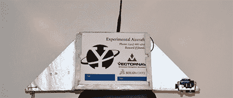

# 发射一个气球，而不是降落在海洋中

> 原文：<https://hackaday.com/2012/10/24/launching-a-balloon-and-not-landing-in-the-ocean/>

在短短的几个小时内，耶鲁大学本科生航空航天协会[将向平流层稀薄的空气中发射他们的第四个高空气球项目](http://yaleaerospace.com/skyview/)，如果运气好的话，将带回康涅狄格长岛、罗德岛和玛莎葡萄园岛上空的照片。

在它们令人惊讶的坚固的一体式底盘中，有两个 GoPro 摄像头和一个三冗余遥测系统，该系统由一个能够传输 40 多英里的定制无线电系统、一个基于手机的通信系统和一个 [SPOT 卫星跟踪器](http://hackaday.com/2012/04/17/communicating-from-anywhere-with-a-spot-connect/)组成。

耶鲁航空航天团队不得不应对一个非常大的问题；因为他们从美国东海岸发射了他们的天空景观气球，很可能他们的有效载荷最终会在大西洋里喝一杯。为了解决这个问题，该团队开发了一种新颖的简化解决方案:一根镍铬合金加热丝缠绕在将有效载荷绑在气球上的绳子上。如果硬件接收到来自地面的信号，或者软件出现问题，或者电池电量耗尽，镍铬合金电路将从运载火箭上释放气球，希望将其返回固体地面。

耶鲁大学航空航天团队还编写了一个定制的 iOS 应用程序，允许追逐汽车实时跟踪气球——如果你试图与高速公路上的几辆汽车通信，这是一个很好的功能。你可以在耶鲁航空航天追踪网站[上查看气球的实时数据，或者直接去](http://yaleaerospace.com/live-4/)[的推特](https://twitter.com/YaleAerospace)上阅读关于这次飞行的最新消息。