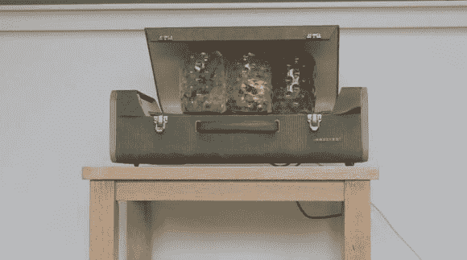

# 拉瓦普频谱分析仪

> 原文：<https://hackaday.com/2013/12/04/lavaamp-equalizer/>

你的满是灰尘的熔岩灯不再酷了吗？如果你能让它随着音乐冒泡呢？[克里斯蒂安]和[埃里克]设法做到了这一点。

不，它们不是普通的熔岩灯。事实上，它们看起来像超大的果酱罐，但它们的视频非常酷！他们为 [UIST 2013 学生创新竞赛](http://www.acm.org/uist/uist2013/contest.php)设计并建造了这个系统，虽然没有太多关于实际建造的信息，但竞赛要求每个人都使用[完全相同的套件](http://www.youtube.com/watch?v=nnsf7uBV_ow)。该套件包括 8 个水族箱泵、一个 PumpSpark 控制器板、各种管道和配件以及一个用于 Arduino 或另一种微控制器的光学隔离串行接口。从那里，很容易猜出剩下的部分——分析音频，并根据不同的音量对泵进行计时。

其他值得注意的参赛作品包括一个令人敬畏的游戏[水盆](http://www.youtube.com/watch?v=0lQSo3uoef0)，一个[水瓶风笛](http://www.youtube.com/watch?v=8pY_USsqFxs)，甚至还有一个 [Xbox H2O](http://www.youtube.com/watch?v=LuOLUI6dYl0) ！

休息后留下来看 LavaAMP 气泡到低音。

[https://player.vimeo.com/video/80901342](https://player.vimeo.com/video/80901342)