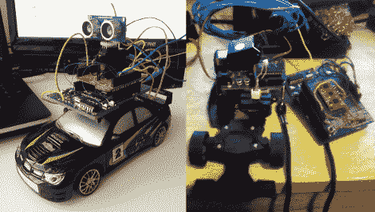

# LayerOne 徽章黑客二合一

> 原文：<https://hackaday.com/2012/05/31/layerone-badge-hacking-twofer/>

这里有一对 LayerOne 徽章黑客，实际上包括徽章设计师打算钢筋混凝土。

首先，我们有由 Arko 制造的自动遥控汽车。他称之为小斯坦利，以此向斯坦福 DARPA 大挑战飞行器致敬。它使用 Arduino 盾来添加一个带有超声波测距仪的伺服系统。让车辆开一点，停下来看看地平线，然后再开一些。希望测距仪能防止它撞到任何东西。休息之后会有一个快速测试。

右边是[Zjpahle] [在比赛已经结束](http://zachpahle.wordpress.com/2012/05/29/layerone-badge-hack/)后完成的徽章破解。他还选择了 Arduino 盾，这次是 IMU 板。但他在车上添加了一个独立的 Arduino 板，可以驱动一些 EL 线(地面效果)，并在车的前面添加了红外传感器。红外传感器用于避障，IMU 让他倾斜徽章进行方向控制。

周三我们看了徽章黑客大赛的冠军。那次黑客攻击并不涉及汽车，但[用徽章作为莫尔斯电码信标](http://hackaday.com/2012/05/30/morse-code-beacon-wins-the-layerone-badge-hacking-contest/)。

[https://www.youtube.com/embed/V4vyJ-SEwXo?version=3&rel=1&showsearch=0&showinfo=1&iv_load_policy=1&fs=1&hl=en-US&autohide=2&wmode=transparent](https://www.youtube.com/embed/V4vyJ-SEwXo?version=3&rel=1&showsearch=0&showinfo=1&iv_load_policy=1&fs=1&hl=en-US&autohide=2&wmode=transparent)

[谢谢查理克斯]