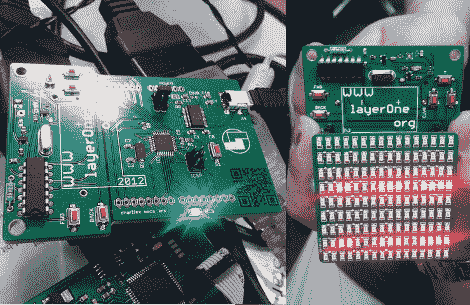

# LayerOne 徽章阻挡子弹；赶走

> 原文：<https://hackaday.com/2012/05/24/layerone-badges-stop-bullets-drive-away/>

我们喜欢徽章。我们真的要感谢[Charliex]花时间写了一篇关于今年 LayerOne 徽章的大帖子，特别是因为他们已经在最后期限前及时将所有东西收集在一起。

在这里，左边是股票徽章，右边是附加盾。现在最初的意图是使这个徽章成为一辆遥控汽车的底盘。[Charliex]花了大量的开发时间，试图找到可以拆卸的玩具车零件，以便轻松安装在徽章上。这起初看起来很有希望，但结果证明是愚蠢的。相反，我们这里有一个 Arduino 兼容板，带有一个 RF 发射器，如果您愿意，可以切断并单独使用。与会者将能够使用徽章来控制玩具车(它们的箱子已经被运送到会议)，并可以选择使用 USB 功能来促进自动化。

那么挡子弹呢？用于从 Eagle 导出电路板设计的模块[Charliex]中有一个 bug。他们从工厂回来时是 0.125 英寸的基板。那是相当结实的！

会议在这个周末举行……最好抓紧时间！