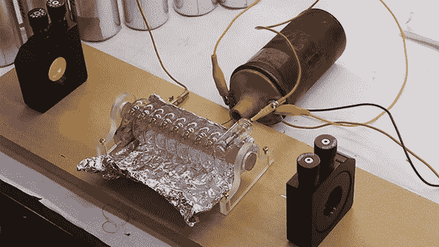

# 与红宝石偷懒

> 原文：<https://hackaday.com/2014/01/10/lazing-with-a-ruby/>

[Ben Krasnow]是一位非常复杂的高科技设备的制造者，[终于开始研制他的红宝石激光器](http://www.youtube.com/watch?v=VSdUQ4oNKiI)。在过去的几年里，他一直在为这个项目收集零件，但直到最近，他才开始再造第一台可见光激光器。

虽然第一台红宝石激光器的设计和制造极其复杂，但其背后的基本思想却非常简单。[Ben]的激光器使用人造红宝石，两端打磨成光学平面。这根棒放在闪光管里。当闪光管亮起时，棒吸收光线，并在几毫秒内以相干光束的形式重新发射出去。这种光束在两个镜子之间反射——一个完全反射，另一个部分反射——并发出连续的相干光子流。这比简单地将激光二极管连接到电源上要复杂得多，但是复制一个仅在 50 年前登上《时代》、《T2》、《新闻周刊》封面的建筑令人印象深刻

现在，[本]的工作台上有他的红宝石激光器的大部分机械和光学部件。下一步是建造一个巨大的电容器组，每毫秒左右给闪光管充电。[本]最终会用他的激光做什么仍然是个未知数，但是如果我们遇到一些铒或钕棒，我们一定会把它们送给他。

[https://www.youtube.com/embed/VSdUQ4oNKiI?version=3&rel=1&showsearch=0&showinfo=1&iv_load_policy=1&fs=1&hl=en-US&autohide=2&wmode=transparent](https://www.youtube.com/embed/VSdUQ4oNKiI?version=3&rel=1&showsearch=0&showinfo=1&iv_load_policy=1&fs=1&hl=en-US&autohide=2&wmode=transparent)