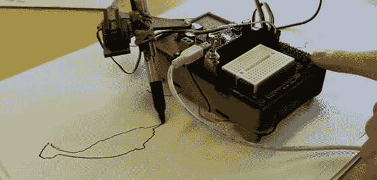

# 学工程，画独角鲸

> 原文：<https://hackaday.com/2013/11/22/learn-engineering-and-draw-narwhals/>

使用乐高机器人和其他“机器人入门”平台是一个很好的运动学和编程入门，但如果你在一个教室里教一群不知道 1/4-20 螺丝是什么的人，也许这不是正确的工程学入门。这就是 NarwhalEdu 即将推出的在线课程背后的想法:给孩子们一堆伺服系统、螺栓和微控制器，他们将能够建造任何东西，而不仅仅是 Mindstorm 机器人的说明。

机器人、绘图和工程是一门围绕一个简单的 SCARA 臂机器人建立的在线课程。它由激光切割的硬纸板制成，由三个伺服系统和一个带扩展护罩的 Arduino Nano 提供动力。在第一个小时的在线课程中，学生们制作了这个机器人，然后学习一点编程，让他们的机器人画出从独角鲸到 nyan 猫和脸的一切。

在课程的第二部分，学生们拆开他们的机器人工具箱，开始制作其他更酷更有趣的设备。有一个最酷项目的竞赛，希望能在很大程度上展示工程的创造性。

下面两段独角鲸 SCARA 手臂动作的视频。

[https://www.youtube.com/embed/h98bR_BJgJw?version=3&rel=1&showsearch=0&showinfo=1&iv_load_policy=1&fs=1&hl=en-US&autohide=2&wmode=transparent](https://www.youtube.com/embed/h98bR_BJgJw?version=3&rel=1&showsearch=0&showinfo=1&iv_load_policy=1&fs=1&hl=en-US&autohide=2&wmode=transparent)

[https://www.youtube.com/embed/2zA8vug241M?version=3&rel=1&showsearch=0&showinfo=1&iv_load_policy=1&fs=1&hl=en-US&autohide=2&wmode=transparent](https://www.youtube.com/embed/2zA8vug241M?version=3&rel=1&showsearch=0&showinfo=1&iv_load_policy=1&fs=1&hl=en-US&autohide=2&wmode=transparent)

[https://www.youtube.com/embed/2v2RA_bAGDU?version=3&rel=1&showsearch=0&showinfo=1&iv_load_policy=1&fs=1&hl=en-US&autohide=2&wmode=transparent](https://www.youtube.com/embed/2v2RA_bAGDU?version=3&rel=1&showsearch=0&showinfo=1&iv_load_policy=1&fs=1&hl=en-US&autohide=2&wmode=transparent)