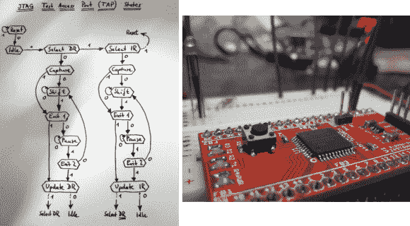

# 通过编写一个有点疯狂的程序员来学习 JTAG

> 原文：<https://hackaday.com/2013/08/31/learn-jtag-by-writing-a-bit-banging-programmer/>

[Pesco]几个月前赢得了一个危险原型的 PCB 赠品。他选择了 CPLD 分线板。他只需要下零件订单，然后自己组装零件。但是然后呢？他需要一名 JTAG 程序员来操作芯片。像任何优秀自学者一样，他选择自己动手，而不是去买一本。他吸收了 JTAG 的规范，用 Arduino 编写了一个小程序员。

我们已经多次使用 JTAG 对 ARM 芯片进行编程。但是直到现在，我们从来没有花时间去弄清楚这个规范是如何工作的。如果你订阅了 IEEE，你可以下载白皮书，但是[Pesco]也可以在互联网上找到一份。左边的流程图是他根据自己的阅读整理的小抄。在那里，他编写了 Arduino 草图，实现了编程标准，允许他通过 minicom 终端窗口与芯片交互。

[via [危险原型](http://dangerousprototypes.com/2013/08/28/the-arduino-as-a-simple-jtag-adapter/)