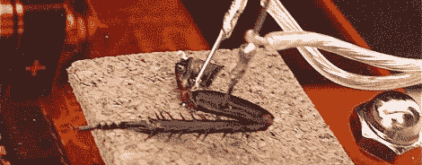

# 用蟑螂腿学习神经科学

> 原文：<https://hackaday.com/2012/10/20/learning-neuroscience-with-cockroach-legs/>

神经科学家[Tim Marzullo]和[Greg Gage]想找到一种方法让孩子们对神经科学感兴趣。他们想出的东西与科学怪人的实验室里发现的东西相差不远。通过切断蟑螂的腿并接上电极，他们能够听到神经元放电的声音。为了更酷的演示，他们能够在腿上施加一点电流，让腿随着野兽男孩的节拍跳舞。

这些人在 PLOS 一台发表了一篇文章和[做了一个 TED 演讲](http://www.ted.com/talks/the_cockroach_beatbox.html)向大众展示他们的 SpikerBox，他们称之为他们的发明。基本想法是放大蟑螂神经元放电产生的电流。通过用 iPad 应用程序监听神经元，[蒂姆]和[格雷格]可以设置记录的阈值，以检测单个神经元的动作电位，并监听单个神经元放电时到底发生了什么。

这似乎是一个很好的工具来解释神经系统和大脑，无论是蟑螂还是人类，实际上都是什么。在休息后的视频中，你可以看到[Greg]在摆弄单个蟑螂神经元。之后，[格雷格]将野兽的*高平原漂流者*放入腿部，使肌肉收缩。真的，科学的声音。

[https://www.youtube.com/embed/tr4gWi9Jf6k?version=3&rel=1&showsearch=0&showinfo=1&iv_load_policy=1&fs=1&hl=en-US&autohide=2&wmode=transparent](https://www.youtube.com/embed/tr4gWi9Jf6k?version=3&rel=1&showsearch=0&showinfo=1&iv_load_policy=1&fs=1&hl=en-US&autohide=2&wmode=transparent)