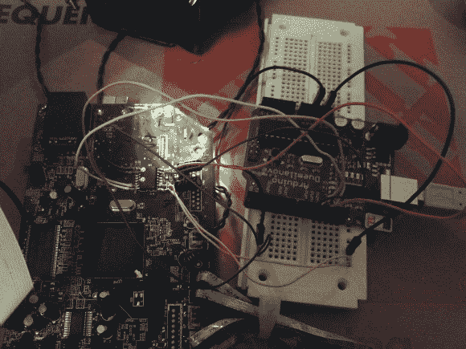

# 在一台坏打印机上学习逆向工程

> 原文：<https://hackaday.com/2014/05/15/learning-to-reverse-engineer-on-a-broken-printer/>

当一台利盟喷墨打印机停止工作时，[Mojobobo]能够[声称这是他自己的](http://www.eevblog.com/forum/projects/lexmark-printer-hacking/ "Lexmark printer hack")。他很快意识到，这台机器被墨水淹没，不值得修理，但这并不意味着他不能找到它的用途。当他得知打印机的固件不仅可以升级，而且不受保护时，他知道他应该能够让打印机按照自己的意愿行事。

[Mojobobo]从主板开始了他的旅程。该设备仍然通电，但它要求在进一步启动之前插入一个“双面模块”。[Mojobobo]首先试图找到欺骗双面模块传感器的方法，但没有成功。他的下一步是寻找某种串行通信端口。他没有示波器，所以他使用了一个带有线探针的扬声器。理论上，如果电线压在一个活动的串行端口上，他将能够通过扬声器听到不同的音调。果然，他在探查了“JTAG”标签旁边的一些端口后，发现了一些有趣的声音。他查找了一些关于附近芯片的信息，发现它包括一条 SPI 总线。

经过一些互联网研究，[Mojobobo]对 SPI 有了足够的了解，对如何使用它有了一个大致的概念。由于可用的工具有限，他决定使用 Arduino 来尝试与主板通信。在连接了一个简单的电路后，(然后重新连接)他能够通过 SPI 接口将主板启动加载程序的前 4096 字节转储到 Arduino。

[Mojobobo 的]下一步将是找到一种更快的方法来转储引导加载程序。在 9600 波特时，他等了三个小时后开始不耐烦了。一旦他有了完整的引导加载程序，他打算寻找一种方法来绕过双工传感器，让主板完成引导。然后，他可能只是使用打印机的扫描功能，或者他可能会发现它的其他有趣的用途。