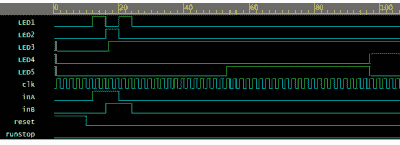

# 学习用于 FPGAs 的 Verilog:触发器

> 原文：<https://hackaday.com/2015/08/20/learning-verilog-for-fpgas-flip-flops/>

上次我谈到了如何在 Verilog 中创建一个加法器，着眼于将它放入一个格子冰棍板。加法器是一个组合电路，不使用时钟。这一次，我们将完成演示设计，并添加两个时钟元件:一个可以记住加法器是否产生进位的锁存器，以及一些计数器，用于将 12 MHz 时钟分频为半秒脉冲，以闪烁一些板载 led。

# 为什么是钟表？

时钟是实用数字设计的重要组成部分。假设你有一个双输入`AND`门。然后想象两个输入都从 0 变到 1，输出也应该从 0 变到 1。理论上，这似乎是合理的，但在现实生活中，这两个信号可能不会同时到达。所以有一小段时间输出是“错误的”对于单个门来说，这可能不是什么大事，因为延迟可能很小。但是误差会增加，并且在更复杂的电路中，当组合门的输入随着不同的延迟而变化时，很容易出现毛刺。

对此，最常见的解决方案是在时钟边沿(通常是上升沿)只“查看”信号(并将它们存储在触发器中)。现在，如果从一个触发器的输出到下一个触发器的输入的最长延迟小于时钟周期，电路将正常工作。这使得设计变得简单多了。

如果你需要复习触发器，它们是记忆单个比特的元素。D 触发器将在时钟边沿记住其输入(名为 D ),并保持该输出直到下一个时钟边沿。还有其他类型的触发器，如 T 触发器(切换状态)或 JK 触发器，它们可以执行多种功能。使用 Verilog，你一般不会直接创建触发器，而是让编译器从你的代码中推断出来。

让我们直接看一些例子。在我们进行的过程中，我会更详细地解释这些。考虑以下代码:

```
reg myoutput;
wire myinput;
always @(posedge clk)
   myoutput<=myinput;

```

这将推断出 D 型触发器。编译器也会识别其他类型。例如:

```
reg myoutput;
wire myinput;
always @(posedge clk)
   myoutput<=myinput?~myoutput:myoutput;

```

这将推断出 T 触发器。不过，通常情况下，推论并不如此直接。输入可以是逻辑表达式。编译器还可以推断计数器是许多触发器:

```
reg [3:0] ctr;
always @(posedge clk)
begin
  if (ctr_reset) ctr<=4'b0; else ctr<=ctr+1;
end

```

就像使用加号运算符让 Verilog 编译器为加法器做最好的事情一样，上面的表达式将让它构建一个高效的计数器，而您不必担心细节。您可以用推断触发器的单个模块(或您的工具为您提供的模块)来构建计数器，但最好将细节留给编译器。

# 构建触发器

演示电路有三个不同的部分:上次的二进制加法器电路已经完成。示例设计的另一部分是在产生进位时提供锁存输出。下面是实现这一点的部分代码:

```
reg carrylatch;
// latch carry result
always @(posedge clk)
begin
   if (reset==1'b1) carrylatch<=1'b0;
   else begin
     if (carry) carrylatch<=1'b1;
   end
end
```

在英语中，这表示当时钟有一个上升沿时，检查复位线是否为高。如果是，清除进位锁存器。否则，检查是否设置了进位，如果是，则设置进位锁存器。它将保持置位，直到复位清除它。

Verilog 工具将识别这是一个带同步复位的触发器。如果你真的很关心性能，你可能想研究一下你的 FPGA 是否能更好地完成异步复位，并了解如何让你的工具去做。但目前来看，这已经足够了。实现可能是一个 D 型触发器，具有一个对上升沿敏感的时钟输入和一个连接到进位线的时钟使能。D 输入将连接到逻辑 1。

# Verilog 要点 2:阻塞与非阻塞分配

有没有注意到有些赋值用`=`有些用`<=`？这是 Verilog 的一个重要特性。当你使用赋值的时候，你总是使用等号。如果你正在写一个连续的程序块，你几乎不需要使用等号，即使 Verilog 允许这样做。原因如下:

```
always @(posedge clk)
begin
a<=1’b1;
b<=a;
end
```

由于非阻塞赋值(`<=`)的出现，b 的值将变成 a 在时钟边沿出现时的值。也就是说，块中的所有赋值同时发生。在模拟中，这意味着它们发生在 end 语句中，因为模拟必须假设所有事情都是并行发生的。在 FPGA 中，并行执行就是硬件的工作方式。

问题是，如果不使用非阻塞赋值。假设我们有:

```
always @(posedge clk)
begin
a=1’b1;
b=a;
end
```

Verilog 编译器非常聪明，知道在这种情况下 b 应该等于 1，并且必须生成额外的电路(一个锁存器)以确保 b 不会与 a 同时设置。这可能会导致许多计时问题，除非您确定需要这样做并理解其后果，否则您应该不惜一切代价避免这样做。

# Verilog 要点 3:默认网络类型

您可能会注意到 Verilog 代码中的一些变量是 wire 类型的，一些是 reg 类型的。电线必须不断地被驱动到某个值。reg 更像是一个常规变量。一个寄存器可以，但不总是，推断一个触发器。但是，您可以在 reg 中设置一个值，它会保持不变。

你在 Verilog 中遇到的一个问题是，如果你编造一个名字，编译器(默认情况下)会认为你的意思是它是一根线，除非你告诉它不是这样。这听起来很方便，但问题是如果你拼错了一个名字，它就变成了一个新的连线，然后你就不知道为什么你的代码没有做你想要的。

答案是始终在 Verilog 文件的前面包含以下内容:

```
`default_nettype none
```

如果使用未声明的网络，这将导致编译器抛出错误。这将为您节省大量调试时间，让您知道为什么事情不能正常工作。

# 计数和除法

Verilog 的其余部分采用 12MHz 时钟，并用它来驱动 16 位计数器。当计数器溢出时，另一个计数器增加。当该计数器达到 91 时，辅助计数器归零。在 12MHz 下，这大约需要 1/2 秒。

注意到 12MHz 等于 83 ns 或 000083 us，你就能算出这一点。16 位计数器将在第 65536 次计数时溢出(2 的 16 次方)。算一算，每个溢出大约需要 5.5 毫秒。如果你让二级计数器到 91，那将需要差不多 497 毫秒。如果你到了 92，你就过去了(502 ms)。注意，计数到 91(或 92)只需要一个 7 位计数器。这里显示了这种情况的图形表示，代码如下。

```
// The 12MHz clock is too fast
// The first counter will / 2^16 (about 5.46ms)
// Then the second counter goes to 91 which is 0.497s
// close enough to 1/2 second for our purpose
always@(posedge clk)
begin
if (reset==1'b1)
begin
  cnt1<=0;
  cnt2<=0;
  half_sec_pulse<=0;
  dec_cntr<=0;
  end
  else if (runstop==1'b0) // don't do anything unless enabled
  begin
    cnt1 <= cnt1 + 1;
    if (cnt1 == 0)
      if (cnt2 == 91)
       begin
         cnt2 <= 0;
         half_sec_pulse <= 1;
      end
   else
     cnt2 <= cnt2 + 1;
  else
     half_sec_pulse <= 0;
  if (half_sec_pulse == 1)
  dec_cntr <= dec_cntr + 1; // count half seconds
  end
end
```

(注意:正如下面的评论中提到的，16 位计数器没有什么特别的。我只是想展示一个嵌套的计数器，但是因为这个例子没有使用中间时钟，你可以很容易地用一个除法做一个更长的计数器。FPGA 不在乎你是做 2 位计数器还是 60 位计数器，除非你用完了资源。)

这是时序电路的一种形式，当综合时，计数器将变成一连串的触发器。以下是计数器的定义:

```
// Manage 12MHz clock
reg [15:0] cnt1;
reg [6:0] cnt2;
reg [1:0] dec_cntr;
reg half_sec_pulse;
```

计数器声明看起来像数组，但它们不是(Verilog 确实支持数组，但这些不是数组)。方括号中的数字告诉你该值的位数。因此，cnt1 有 16 位，从 15(最高有效位)到 0(最低有效位)。

我们将使用类似数组的位表示法和 assign 语句让一些 led 也闪烁:

```
// Make the lights blink
assign LED4 = (dec_cntr == 2);
assign LED5 = dec_cntr[0];
```

# 更新测试平台

由于新设计需要时钟，测试平台必须提供时钟。不得不写每个时钟转换是非常烦人的。幸运的是，你不必这样做。时钟发生器的工作原理如下:

```
always
begin
#1     clk<=~clk;
end
```

用英语来说，这意味着:在任何时候，你都应该延迟一个时钟周期(1)，然后反转时钟信号，并一直这样做下去。另一个需要考虑的问题是 FPGA 复位:

```
rs=1'b0; // run/stop
reset=1'b1;
#10
reset=1'b0;
```

该位代码设置复位线，保持 10 个时钟周期，然后将其清零。

测试平台的末端是一个 400 周期的延迟，只是为了让计数器做一些事情。

# 模拟细节

模拟有一个小问题。12 MHz 分频器“仅”在 400 个周期内不会做任何有趣的事情。模拟时将幻数改为更小的值并不罕见。在这种情况下，我将主计数器增量更改为 8000 hex，这样它将每隔一个时钟周期翻转一次，然后将 91 的测试值更改为一个更合理的值。

[](https://hackaday.com/wp-content/uploads/2015/08/verilog1.png) 有几种方法可以做到这一点，但为了简单起见，我只注释掉真实版本，稍后我将删除注释并注释掉模拟版本。

你可以在 [EDAPlayground](http://www.edaplayground.com/x/8rz) 上看到完整的代码，甚至可以在那里运行模拟。此处显示的波形将会出现。如果你想知道更多关于它是如何工作的，看看这个视频，我会一步一步的讲解。

[https://www.youtube.com/embed/HfhIL7mSaWE?version=3&rel=1&showsearch=0&showinfo=1&iv_load_policy=1&fs=1&hl=en-US&autohide=2&wmode=transparent](https://www.youtube.com/embed/HfhIL7mSaWE?version=3&rel=1&showsearch=0&showinfo=1&iv_load_policy=1&fs=1&hl=en-US&autohide=2&wmode=transparent)

# 下次

下一次，我将向您展示如何使用 Verilog(它应该可以正常工作，因为它可以正确模拟)并将[推送到 FPGA 板](http://hackaday.com/2015/08/27/learning-verilog-for-fpgas-hardware-at-last/)。如果你一直在关注，你至少应该有一个严肃的问题:例如，我如何告诉某人 LED1 映射到板上的 LED？这个问题很棒，下次我来回答。这里有一个线索:它不依赖于网络的名称。我可以把这个信号叫做 BigJim，我仍然可以把它映射到 led 上。如果你打算继续工作，现在就安装[开源工具包](http://www.clifford.at/icestorm/)可以让你有一个好的开始。当然，如果你没有冰棍，那也没什么用，除非你只是想试运行一下工具。

# 精选教程

如果您正在寻找详细的 Verilog 教程，请尝试以下内容:

*   [Doulos(EDA playground 的主持人)有一套非常专业的教程](https://www.doulos.com/knowhow/verilog_designers_guide/)
*   [另一个教程设置为自学课程](http://vol.verilog.com/)
*   EDAPlayground 的创建者在 YouTube 上有一个系列会很有帮助，尤其是如果你正在使用 EDAPlayground 的话

[你也可以阅读本系列的下一篇文章](http://hackaday.com/2015/08/27/learning-verilog-for-fpgas-hardware-at-last/)。

[https://www.youtube.com/embed/eXb8prknDKg?version=3&rel=1&showsearch=0&showinfo=1&iv_load_policy=1&fs=1&hl=en-US&autohide=2&wmode=transparent](https://www.youtube.com/embed/eXb8prknDKg?version=3&rel=1&showsearch=0&showinfo=1&iv_load_policy=1&fs=1&hl=en-US&autohide=2&wmode=transparent)