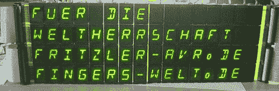

# LED 阵列使用了大量的 14 段显示器

> 原文：<https://hackaday.com/2012/09/23/led-array-uses-ridiculous-amount-of-14-segment-displays/>

如果你看到一堆 14 段的 LED 显示屏卖一分钱一个，你会怎么做？[弗里茨勒]在面对这个难题时做了我们任何人都会做的事情——他买了 64 个 14 段显示器，建造了一个巨大的 16×4 字母数字显示器(德语，[这里是翻译](http://translate.google.com/translate?sl=de&tl=en&js=n&prev=_t&hl=en&ie=UTF-8&layout=2&eotf=1&u=http%3A%2F%2Ff3.webmart.de%2Ff.cfm%3Fid%3D1663923%26t%3D3949725%26r%3Dthreadview&act=url))。

[弗里茨勒]在 [electrobi.de](http://www.electrobi.de/Werkstatt/Elektronische-Komponenten/LCD-Segmentanzeigen/) 找到了€0.01 的旧东德 14 段显示器的缓存(不用麻烦了，它们已经没货了)，他唯一能想到的就是建造一个巨大的显示器。他为每个 LED 模块使用 ULN2803 达林顿驱动器，但仍然存在控制整个显示器的问题。

为此，[弗里茨勒]决定让他的 16×4 使用与日立 HD 44780LCD 控制器相同的协议。这意味着[弗里茨勒]可以把他巨大的、耗电的显示器连接到微控制器上，就像它是一个简单的液晶显示器一样。

一组[对](http://www.abload.de/image.php?img=img_1303ksmxl1.jpg)的[图片](http://www.abload.de/image.php?img=img_1271k7usqu.jpg)展示了【弗里茨勒】必须焊接的东西，这证明了这个展示的创作投入了大量的工作。

感谢[freax]发送此邮件。